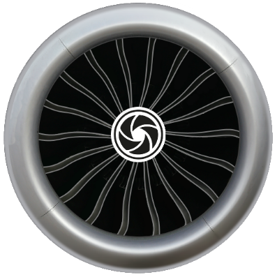

Table of Contents

[Prerequisites [4](#prerequisites)](#prerequisites)

[Software and Licensing
[4](#software-and-licensing)](#software-and-licensing)

[Microsoft System Requirements
[4](#microsoft-system-requirements)](#microsoft-system-requirements)

[Milestone XProtect System Requirements
[4](#milestone-xprotect-system-requirements)](#milestone-xprotect-system-requirements)

[ORBNET Systems [5](#orbnet-systems)](#orbnet-systems)

[Copyright, trademarks, and disclaimer
[5](#copyright-trademarks-and-disclaimer)](#copyright-trademarks-and-disclaimer)

[Software Schematic with Installation Methods
[6](#software-schematic-with-installation-methods)](#software-schematic-with-installation-methods)

[Installation Methods Guide
[7](#installation-methods-guide)](#installation-methods-guide)

[Installation of Streaming Engine for Milestone XProtect
[9](#installation-of-streaming-engine-for-milestone-xprotect)](#installation-of-streaming-engine-for-milestone-xprotect)

[Initial connection to Milestone
[11](#initial-connection-to-milestone)](#initial-connection-to-milestone)

[Basic User setup [13](#basic-user-setup)](#basic-user-setup)

[Changing to a service account
[14](#changing-to-a-service-account)](#changing-to-a-service-account)

[License activation [16](#license-activation)](#license-activation)

[Streaming Engine Tab in Management Application
[19](#streaming-engine-tab-in-management-application)](#streaming-engine-tab-in-management-application)

[Streaming – RTSP [20](#_Toc115795537)](#_Toc115795537)

[Live RTSP Stream URL Formation
[20](#live-rtsp-stream-url-formation)](#live-rtsp-stream-url-formation)

[Live RTSP Additional URL parameters
[21](#live-rtsp-additional-url-parameters)](#live-rtsp-additional-url-parameters)

[Playback RTSP Stream URL Formation
[22](#playback-rtsp-stream-url-formation)](#playback-rtsp-stream-url-formation)

[RTSP Stream Testing [23](#rtsp-stream-testing)](#rtsp-stream-testing)

[Streaming – HLS [25](#_Toc115795542)](#_Toc115795542)

[HLS Stream URL Formation
[27](#hls-stream-url-formation)](#hls-stream-url-formation)

[HLS URL Test [27](#hls-url-test)](#hls-url-test)

[HLS Webpage Example [28](#hls-webpage-example)](#hls-webpage-example)

[Streaming – RTMP [29](#_Toc115795546)](#_Toc115795546)

[RTMP Stream Testing [30](#rtmp-stream-testing)](#rtmp-stream-testing)

[RTMP YouTube API [32](#rtmp-youtube-api)](#rtmp-youtube-api)

[RTMP Pause and Resume Events
[33](#rtmp-pause-and-resume-events)](#rtmp-pause-and-resume-events)

[Streaming – MJPEG [34](#_Toc115795550)](#_Toc115795550)

[MJPEG Stream URL Formation
[34](#mjpeg-stream-url-formation)](#mjpeg-stream-url-formation)

[MJPEG Additional URL parameters
[34](#mjpeg-additional-url-parameters)](#mjpeg-additional-url-parameters)

[MJPEG URL Test [36](#mjpeg-url-test)](#mjpeg-url-test)

[MJPEG Webpage Example
[37](#mjpeg-webpage-example)](#mjpeg-webpage-example)

[Timelapse & Auto-Snapshots
[40](#timelapse-auto-snapshots)](#timelapse-auto-snapshots)

[Timelapse & Auto-Snapshots Guidance
[41](#timelapse-auto-snapshots-guidance)](#timelapse-auto-snapshots-guidance)

[Timelapse & Auto-Snapshots Settings
[41](#timelapse-auto-snapshots-settings)](#timelapse-auto-snapshots-settings)

[Timelapse Settings [42](#timelapse-settings)](#timelapse-settings)

[Snapshot on Event Settings
[42](#snapshot-on-event-settings)](#snapshot-on-event-settings)

[Stream Ingest – RTSP into Milestone
[44](#stream-ingest-rtsp-into-milestone)](#stream-ingest-rtsp-into-milestone)

[Stream Ingest – RTMP into Milestone
[45](#stream-ingest-rtmp-into-milestone)](#stream-ingest-rtmp-into-milestone)

[Stream Ingest – MP4 to Web
[47](#stream-ingest-mp4-to-web)](#stream-ingest-mp4-to-web)

[MP4 Stream URL Formation [47](#_Toc115795563)](#_Toc115795563)

[MP4 Webpage Example [47](#mp4-webpage-example)](#mp4-webpage-example)

[Advance Streaming Engine Settings
[48](#advance-streaming-engine-settings)](#advance-streaming-engine-settings)

[API Settings [49](#api-settings)](#api-settings)

[Milestone Connection Settings
[49](#milestone-connection-settings)](#milestone-connection-settings)

[ORBSS Settings [50](#orbss-settings)](#orbss-settings)

[RTSP Server Settings
[50](#rtsp-server-settings)](#rtsp-server-settings)

[Streaming Engine Settings
[51](#streaming-engine-settings)](#streaming-engine-settings)

[UDP Settings [52](#udp-settings)](#udp-settings)

[Streaming Engine API Data
[53](#streaming-engine-api-data)](#streaming-engine-api-data)

[CSV Export – Cameras Information
[53](#csv-export-cameras-information)](#csv-export-cameras-information)

[Import HTTPS Certificate
[54](#import-https-certificate)](#import-https-certificate)

[System TCP/IP Ports Used
[55](#system-tcpip-ports-used)](#system-tcpip-ports-used)

[Troubleshooting [56](#troubleshooting)](#troubleshooting)

[Event Server Installation
[56](#event-server-installation)](#event-server-installation)

# Prerequisites

## Software and Licensing

### Microsoft System Requirements

- Microsoft® Windows® 10 Pro (64 bit)

- Microsoft® Windows® 10 Enterprise (64 bit)

- Microsoft® Windows® 10 Enterprise LTSB 2016 (version 1607 or later)

- Microsoft® Windows® 10 IoT Enterprise, version 1803 or later (64 bit),
  IoT Core

- Microsoft® Windows® Server 2016 (64 bit): Essentials, Standard and
  Datacenter

- Microsoft® Windows® Server 2019 (64 bit): Essentials, Standard and
  Datacenter

### Milestone XProtect System Requirements

- XProtect Essential+, Express+, Professional+, Expert, Corporate 2021
  R1 (21.1a) or above

<!-- -->

- Milestone Event Server

  - The Event Server is included as part of you Milestone installation.
    **\*Note\*** ***If this component has not been installed with your
    version follow the steps found in troubleshooting at the end of this
    document.***

- Milestone Device Licenses applied to your XProtect base license.

  - Each video device attached to Milestone will require a device
    license to provide access to the Streaming Engine.

  - The Streaming Engine only connects to devices added to Milestone.

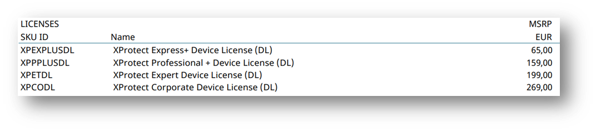

### ORBNET Systems

- License –

  - When you first install the Stream Engine you will get a 30-day trial
    license, following this you will need to update to a paid license.

  - From the website [ORBNET Systems - ORBNET Streaming
    Engine](https://orbnetsys.com/streamingengine) select “ORDER NOW!”

- Installer – ‘ORBNET Streaming Engine Service Setup.msi’

> Available to download from <https://orbnetsys.com/> Register once
> registered and signed into the website [ORBNET Systems - ORBNET
> Streaming Engine](https://orbnetsys.com/streamingengine)

- Installer – ‘ORBNET Streaming Engine Plugins Setup.msi’

> Available to download from <https://orbnetsys.com/> Register once
> registered and signed into the website [ORBNET Systems - ORBNET
> Streaming Engine](https://orbnetsys.com/streamingengine)

### Copyright, trademarks, and disclaimer

**<u>Copyright © 2022 ORBNET Systems</u>**

Copyright law and international treaties protect this Software.

Licensing agreements specify the terms and conditions of the Software
use.

Neither the Customer nor any third party will be permitted to inspect,
possess, use, copy, or attempt to discover any part of the Software
source code (or any portion thereof).

**<u>Trademarks</u>**

XProtect is a registered trademark of Milestone Systems A/S.

Microsoft and Windows are registered trademarks of Microsoft
Corporation.

This document contains other trademarks which belong to their respective
owners.

**<u>Disclaimer</u>**

In preparing this text, due care has been taken to ensure that it is
intended for general information purposes only.

Information provided herein does not constitute any kind of warranty,
and any risk resulting from its use rests with the recipient.

Adjustments may be made without prior notification by ORBNET Systems.

In this text, all names and organizations referenced in examples are
fictitious.

# Software Schematic with Installation Methods

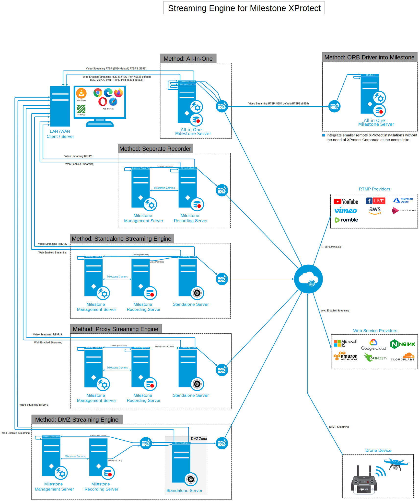

## Installation Methods Guide

**<u>Method: All-In-One</u>**

Where the Milestone XProtect Management, Recording and Event services
reside on the same server.

Both installers are to be installed on this one server.

- ‘ORBNET Streaming Engine <u>Plugins</u> Setup.msi’

- ‘ORBNET Streaming Engine <u>Service</u> Setup.msi’

External connections to the Streaming Engine are made to the all-in-one
Milestone server address.

If connecting from a XProtect Management Client elsewhere on the LAN the
‘ORBNET Streaming Engine <u>Plugins</u> Setup.msi’ will be needed to
access the Streaming Engine settings.

**<u>Method: Separate Recorder</u>**

Where the XProtect Management and Event service are on one server and
the XProtect Recording service is on a sperate server.

Server with XProtect Management and Event service, install.

- ‘ORBNET Streaming Engine <u>Plugins</u> Setup.msi’

Server with XProtect Recording service, install.

- ‘ORBNET Streaming Engine <u>Service</u> Setup.msi’

External connections to the Streaming Engine are made to the Milestone
Recording server address.

If connecting from a XProtect Management Client elsewhere on the LAN the
‘ORBNET Streaming Engine <u>Plugins</u> Setup.msi’ will be needed to
access the Streaming Engine settings.

**<u>Method: Standalone Streaming Engine</u>**

Where the XProtect Management and Event service are on one server and or
XProtect Recording service is on a sperate server. Where the Streaming
Engine is to be run from a dedicated separate machine.

Server with XProtect Management and Event service, install.

- ‘ORBNET Streaming Engine <u>Plugins</u> Setup.msi’

Server dedicated to Streaming Engine, install.

- ‘ORBNET Streaming Engine <u>Service</u> Setup.msi’

External connections to the Streaming Engine are made to the Streaming
Engine server address.

If connecting from a XProtect Management Client elsewhere on the LAN the
‘ORBNET Streaming Engine <u>Plugins</u> Setup.msi’ will be needed to
access the Streaming Engine settings.

**<u>Method: Proxy Streaming Engine</u>**

Where the XProtect Management and Event service are on one server and or
XProtect Recording service is on a sperate server and connections are to
be hidden. Where the Streaming Engine is to be run from a dedicated
separate machine and used to hide where the video originates from. Used
to publish content on another subnet or online.

Server with XProtect Management and Event service, install.

- ‘ORBNET Streaming Engine <u>Plugins</u> Setup.msi’

Server with XProtect Recording service, install.

- ‘ORBNET Streaming Engine <u>Service</u> Setup.msi’

Server dedicated to Streaming Engine, install.

- ‘ORBNET Streaming Engine <u>Service</u> Setup.msi’

External connections to the Streaming Engine are made to the dedicated
Streaming Engine server address. These connections pass through the
first Streaming Engine, located on the Recording server and hide the
video source. This can be done through multiple Streaming Engines.

If connecting from a XProtect Management Client elsewhere on the LAN the
‘ORBNET Streaming Engine <u>Plugins</u> Setup.msi’ will be needed to
access the Streaming Engine settings.

**<u>Method: DMZ Streaming Engine</u>**

Where the XProtect Management and Event service are on one server and or
XProtect Recording service is on a separate server. Where the Streaming
Engine is to be run from a dedicated separate machine that resides in
the demilitarized zone (DMZ). Mostly used for publishing content to a
website or to the internet.

Server with XProtect Management and Event service, install.

- ‘ORBNET Streaming Engine <u>Plugins</u> Setup.msi’

Server dedicated to Streaming Engine in the DMZ, install.

- ‘ORBNET Streaming Engine <u>Service</u> Setup.msi’

External connections to the Streaming Engine are made to the Streaming
Engine server address or public IP address.

If connecting from a XProtect Management Client elsewhere on the LAN the
‘ORBNET Streaming Engine <u>Plugins</u> Setup.msi’ will be needed to
access the Streaming Engine settings.

**<u>Method: Other Methods</u>**

These are not the only methods of installing the Streaming Engine
application. If you wish to discuss further your project or intended
solution, please email (<support@orbnetsys.com>). We can propose a
design method to best work with Milestone XProtect and your intended
solution.

# Installation of Streaming Engine for Milestone XProtect

Begin with the server/machine running the Milestone XProtect Management,
Event services and any machines with a Management Client that will need
access to Streaming Engine settings.

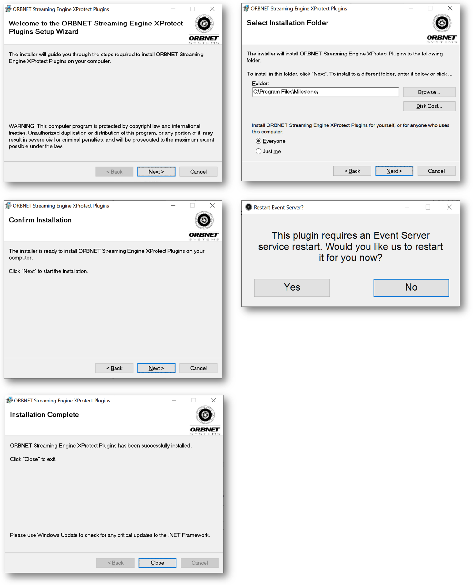Run the ‘ORBNET Streaming Engine Plugins
Setup.msi’

Follow with the server/machine selected to be used for the Streaming
Engine service.

Run the ‘ORBNET Streaming Engine Service Setup.msi’

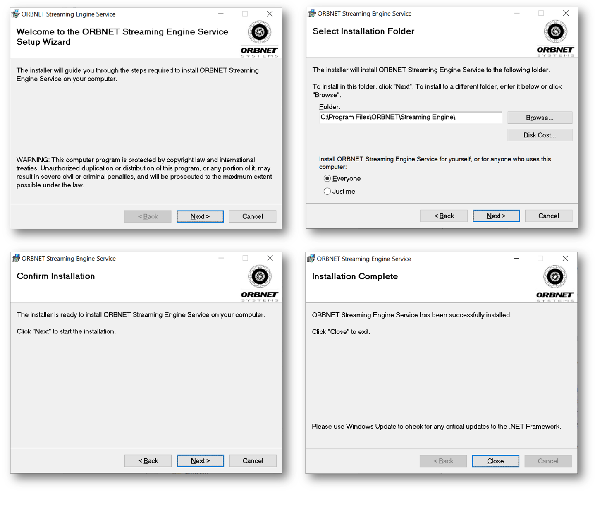

## Initial connection to Milestone

>  alt="Icon Description automatically generated" />Ensure you have
> either have a Milestone Basic account created or a Windows service
> account ready and assigned to a Security role in Milestone to be used
> for the Streaming engine service.
>
> See **<u>Basic User Setup</u>** or [**Changing a service
> account**](#changing-to-a-service-account)

After installation the Streaming Engine service will not be connected to
the Milestone XProtect system.

The Streaming Engine Manager will show in the taskbar with a red cross
to indicate a problem. If the task icon is not showing, check that it is
not hidden in the system tray or run from the desktop shortcut.

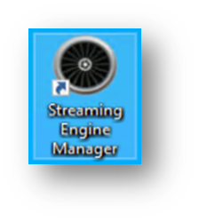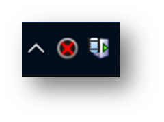

Right click the tray icon and select Change settings…

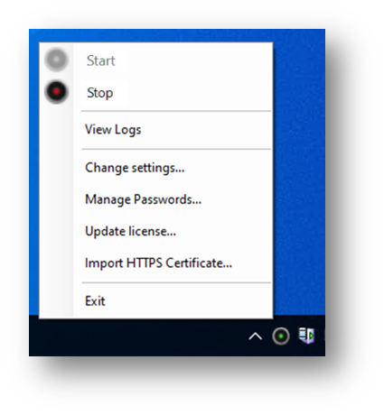

Service Restart confirmation, Click Yes

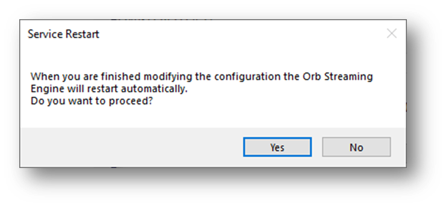

From Streaming Engine Settings two Milestone user options are available.

1.  <u>Log in with service account credentials</u> (See [**Changing a
    service account**](#changing-to-a-service-account) in this document)

*\[Uses the windows account that is running the “ORBNET Streaming
Engine” service to login to Milestone. If set to true, you must change
the service user from “Network Service” to a domain service account of
your choosing and add the service account to Milestone security
roles.\]*

2.  <u>Milestone Basic User</u> (See [**Basic user
    setup**](#basic-user-setup) in this document)

*\[This is a uses a Milestone created basic user account, the account
needs to be added to a relevant Milestone security role. Only works if
“Log in with service account” is set to false.\]*

- Fill out the correct <u>Milestone Management Server IP</u> address and
  port.

- Tick <u>Secure Only</u> if you have installed Milestone using a
  Management Server certificate.

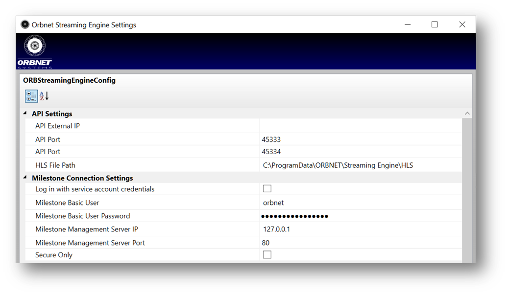

Finish your configuration changes then exit with the close-window cross
at the top right of this window. You will get a message “Config saved!”

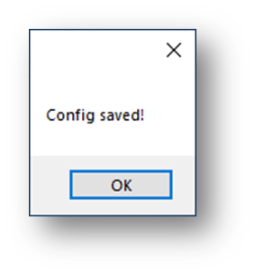

### Basic User setup

>  alt="Icon Description automatically generated" />**<u>Basic
> user:</u>** a dedicated VMS user account authenticated by a
> combination of username and password using a password policy. Basic
> users connect to the VMS using a secure socket layer (SSL) with
> current Transport Layer (TLS) security protocol session for login,
> encrypting the traffic contents and username and password.

Setup of a Basic user account is completed in the <u>Milestone XProtect
Management Application</u>, under Security group then Basic Users. You
can add a new user by right clicking Basic Users or the white space in
the middle tile.

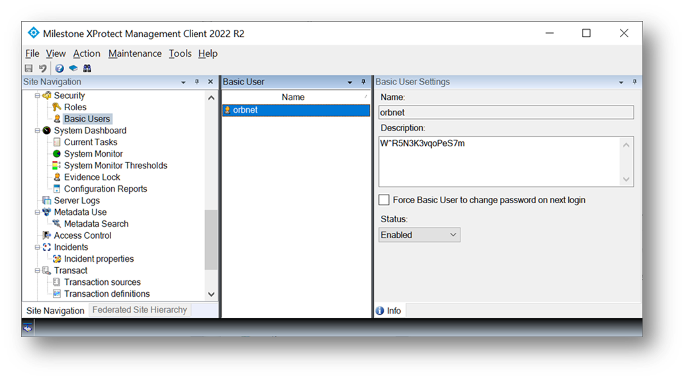

Ensure this account is associated with a Role relevant to the access
required for the Streaming Engine service *(i.e. Live access to any
cameras that will be re-streamed)*

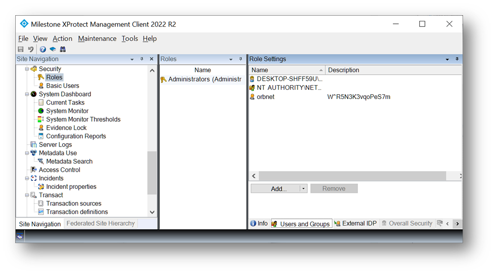

### Changing to a service account

For installations that require the use of a local Windows service
account or domain service account authentication, please update the
Service <u>Log On</u> account used via <u>Windows Services</u>.

>  alt="Icon Description automatically generated" />Please ensure the
> Milestone Management and Recording Service are already changed to a
> service account and this account has Administrator rights via the
> Milestone roles. It is also best to do this while in trial mode as the
> ORBNET license may need to have to be re-issued once changed. If the
> account is new for this machine, please ensure that the user has been
> logged into Windows.

Stop the Streaming Engine service first.

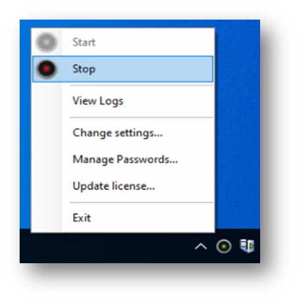

Navigate to Windows Services and locate <u>ORBNET Streaming Engine.</u>

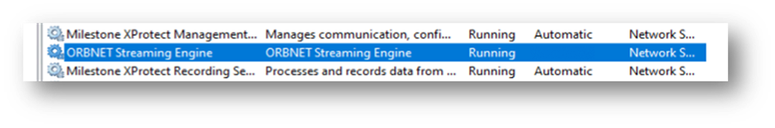

Right click the service and select Properties, then navigate to the Log
On tab. From here you will be able to update the account used by the
service.

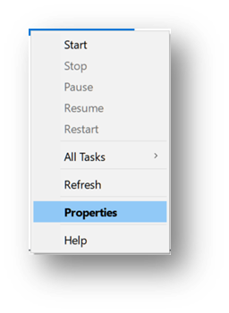

Click Browse and locate the relevant service account to be used for the
Streaming Engine. In most cases this should be the same service account
used for the Milestone services.

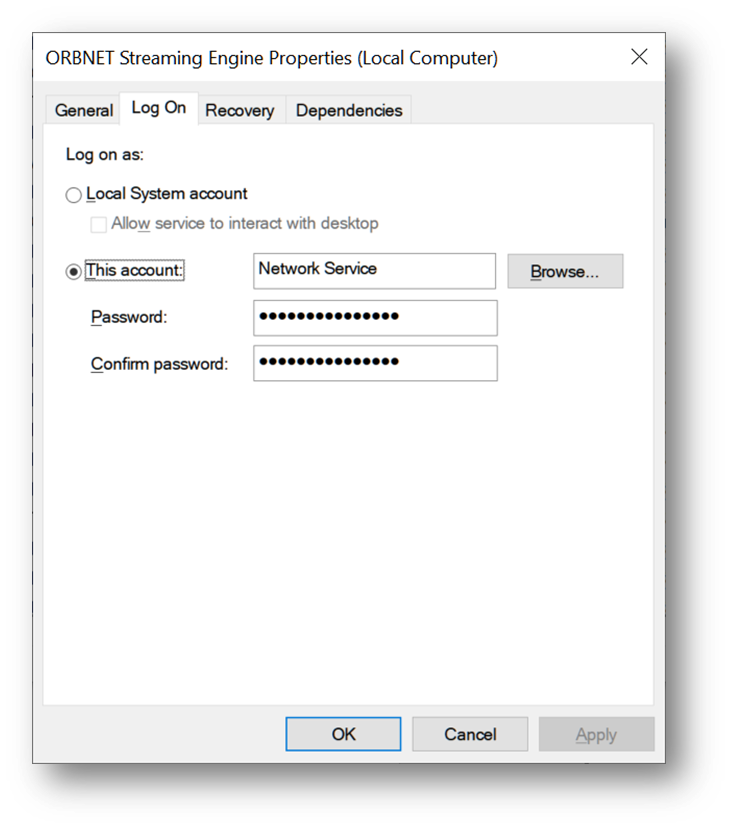
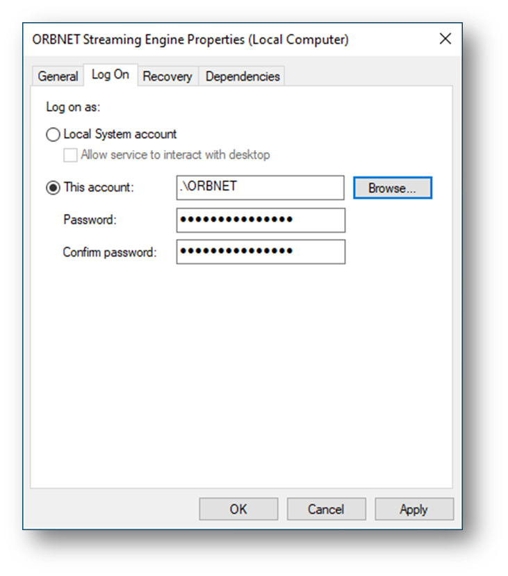

Ensure this account is associated with a Role relevant to the access
required for the Streaming Engine service *(i.e. Live access to any
cameras that will be re-streamed)*.

# License activation

> When you first install the Stream Engine you will get a 30-day trial
> license, following this you will need to update to a paid license.
> Product version revisions will require a new updated license, access
> to version is restricted via a valid ORB Up related to the license
> purchase.

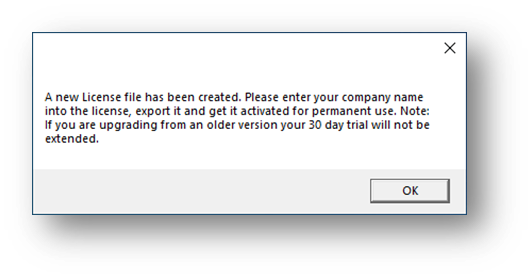

The ORBNET Streaming Engine License information can be accessed from the
Streaming Engine Tray controller. Stop the Streaming Engine service
first.

Then right click again and you can then select Update license…

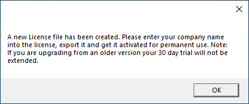

This page will initially show the default license values with just the
trial license countdown at the top.

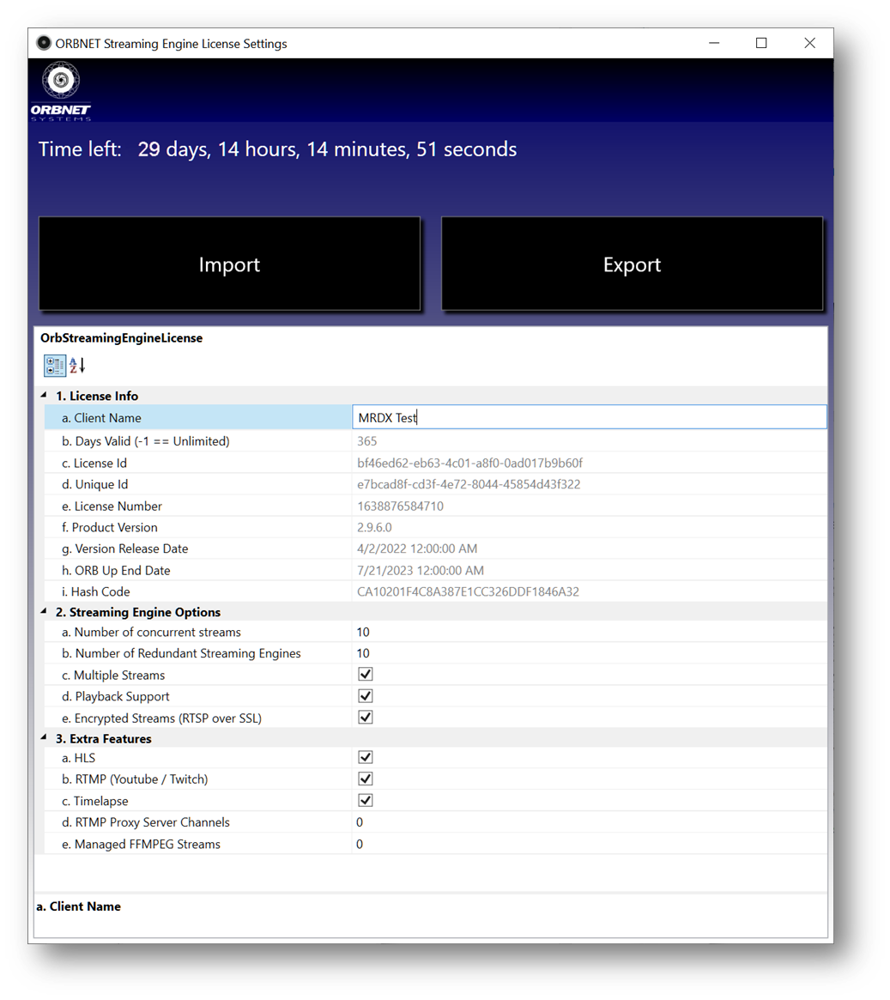

Import and Export buttons for license requests and software activation.

When making a license request, please complete the fields in bold.

- 1\. <u>License Info</u>

  - Enter the site name

- 2\. <u>Streaming Engine Options</u>

  - Increment the values of the options and enable the required
    checkboxes

- 3\. <u>Extra Features</u>

  - Increment the values of the options and enable the required
    checkboxes

Use the Export license request button to generate a license request
file. This will be required to be included in an email to ORBNET Systems
([purchase@orbnetsys.com](mailto:purchase@orbnetsys.com?subject=License%20Request%20-%20Streaming%20Engine))
when requesting your activated product license.

On completion of an order alongside a license request file a valid
license will be sent back. This can be imported by using the Import
valid license button.

This will now show an unlimited <u>(Days Valid = -1)</u> time frame
associated to the Streaming Engine at the top.

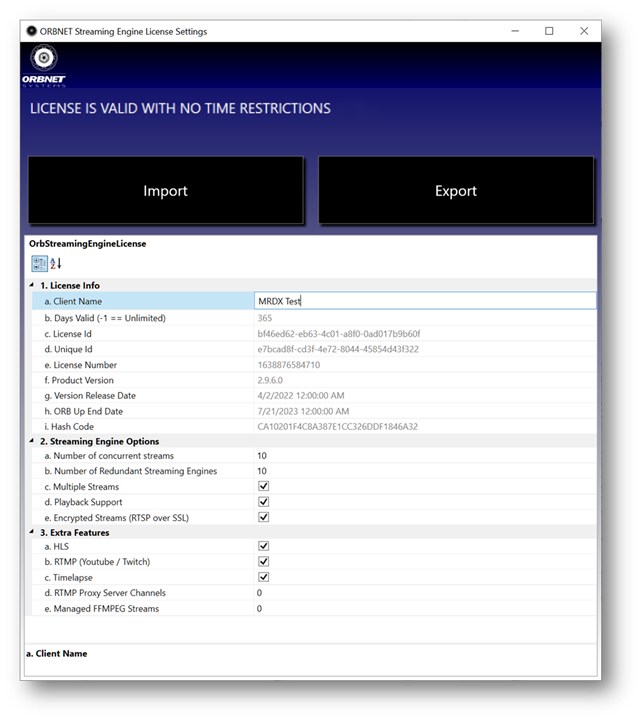

# Streaming Engine Tab in Management Application

The Streaming Engine settings are made available within a hardware
device video channel. Select the video channel (**1.**) you wish to work
with then in the Properties pane (2.) locate the tabbed settings groups
(3.). Streaming Engine is located at the furthest right (4.).

If your display window is not
large enough some tabs may be hidden and you will have to use the arrow
keys to move over to the right.

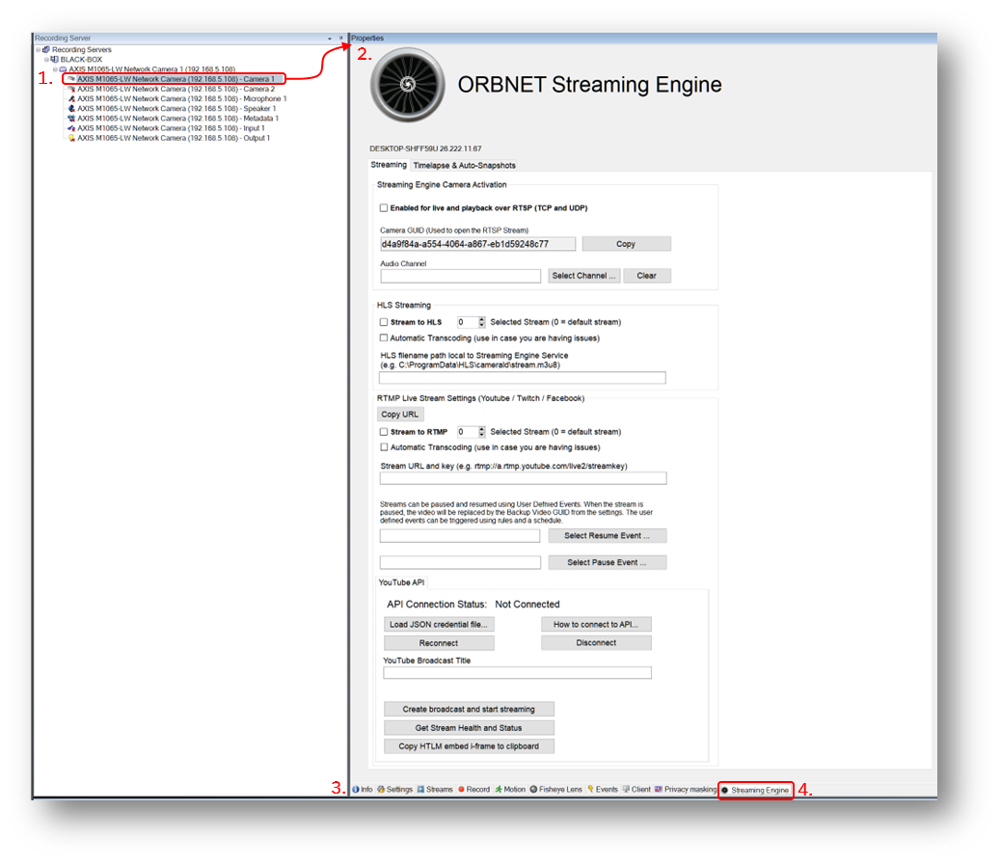

## Streaming – RTSP

>  alt="Icon Description automatically generated" />Real Time Streaming
> Protocol (RTSP) is used to transport video streams with or without
> audio. The transport method can be in UDP or TCP with or without SSL.

RTSP is for applications that supports receiving video streams. This
could be a video player like VLC or a video management system like
Milestone (When used with the correct driver; <u>ORB Driver</u>).

RTSP is not for web browser streaming, the RTSP URL is not supported for
direct streaming

<u>Enabled for live and playback over RTSP</u> Tick to enable a RTSP
video feed for streaming.

>  alt="Icon Description automatically generated" />Unlike other settings
> in Milestone the save button does not apply the setting, these are
> enabled as soon as the option is selected.

<u>Camera GUID</u> references the video channel identifier used by the
Streaming Engine to create unique RTSP URL for each video channel. Use
Copy to copy and paste the GUID to another application like VLC.

<u>Audio Channel</u> if you wish to use an audio channel alongside the
video channel use Select Channel to find an audio channel that already
exists in Milestone. To remove the audio channel, select Clear.

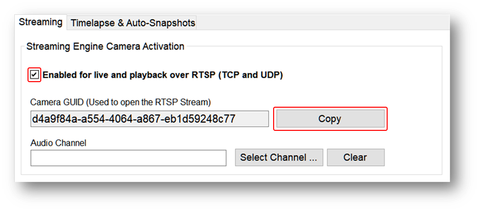No Audio will stream
if the Audio Channel is not selected manually.

### **Live RTSP Stream URL Formation**

URL = \[ rtsp://\<streaming-engine-ip\>:\<port\>/\<camera-guid\> \]

<u>\<streaming-engine-ip\></u> = The IP address of the server with the
Streaming Engine installed.

<u>\<port\></u> = As default the port used is 8554, 8555 if using RTSP
over SSL (RTSPS).

<u>\<camera-guid\></u> = The unique camera channel identifier copied
from the Streaming Engine tab.

<u>rtsp://192.168.0.100:8554/d4a9f84a-a554-4064-a867-eb1d59248c77</u>

This is the URL in its most basic form.

<u>rtsp://91.37.144.121:8554/77b2067c-1387-4480-aa28-c6f83e452af4</u>

In this URL an external IP address has been used, this requires a port
forward on a firewall to be setup for (port 8554).

### **Live RTSP Additional URL parameters**

After the <u>\<camera-guid\></u> the Streaming Engine will support the
additional parameters below.

\[ …/stream=\<id\> \]

<u>\<id\></u> = Lookup of Stream name value (No spaces allowed).

In the below example we have an Axis IP camera, this has eight streaming
channels. The \<id\> of the stream is determined by the <u>Stream</u>
name in Milestone, shown on the left in the below example. We need to
take something unique from this name \[**<u>Video stream 2</u>**\] and
cannot use spaces.

\[ …/stream=2 \]

>  alt="Icon Description automatically generated" />For other devices the
> naming can differ, instead of default name of \[**<u>Video stream
> 1</u>**\] this might be \[**<u>JPEG</u>**\] in this case this would be
> what is used.

\[ …/stream=JPEG \]

> 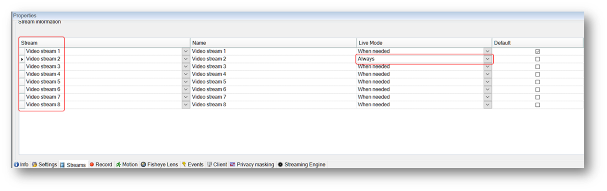 alt="Graphical user interface, application Milestone XProtect" /> alt="Icon Description automatically generated" />When using sub-video
> streams ensure the video stream to be used is included in the Streams
> tab as a secondary stream. Update Live Mode for this video stream to
> Always, without this enabled the video stream is not made available as
> live to the Streaming Engine from Milestone.

<u>rtsp://192.168.0.100:8554/63c02a95-4d86-4d63-95ac-b3b755784c7d/stream=2</u>

<u>rtsp://192.168.0.100:8554/63c02a95-4d86-4d63-95ac-b3b755784c7d/stream=JPEG</u>

This would be the full URL with the stream parameter.

>  alt="Icon Description automatically generated" />If the name used for
> the stream parameter is not unique or mistyped the Streaming Engine
> will resolve the Default Milestone stream

### **Playback RTSP Stream URL Formation**

URL = \[
rtsp://\<streaming-engine-ip\>:\<port\>/\<camera-guid\>/unix=\<start-timestamp\>/unixend=\<end-timestamp\>
\]

To retrieve recordings from the Streaming Engine, a mandatory start
timestamp must be specified, and an optional end timestamp can be
specified.

\[ …/unix=\<start-timestamp\> \]

<u>\<start-timestamp\></u> = The Unix timestamp of the start of the
video recording.

\[ …/unixend=\<end-timestamp\> \]

<u>\<end-timestamp\></u> = The Unix timestamp of the end of the video
recording (optional).

<u>rtsp://192.168.0.100:8554/d4a9f84a-a554-4064-a867-eb1d59248c77/unix=</u>
<u>1664204763</u>

This is the URL with a start Unix timestamp and no end Unix timestamp.

<u>rtsp://192.168.0.100:8554/d4a9f84a-a554-4064-a867-eb1d59248c77/unix=</u>
<u>1664204763/unixend=1664211963</u>

This is the URL with a start Unix timestamp and an end Unix timestamp.

- If there are no recordings available at the selected timestamp, the
  Streaming Engine will automatically skip to the next available clip of
  recorded video.

- When playing back recorded video, the Streaming Engine will
  automatically skip if there are gaps in the recorded video.

- When specifying the optional end timestamp, the Streaming Engine will
  terminate the stream as soon as the timestamp of the video is greater
  or equal to specified end timestamp.

> Unix time is a system for representing a point in time. It is the
> number of seconds that have elapsed since January 1st, 1970 00:00:00
> UTC alt="Icon Description automatically generated" />. Use an online tool
> to convert to the required time and date. [Unix Timestamp - Epoch
> Converter - TimeStamp Converter](https://unixtime.org/)

**  
**

### **RTSP Stream Testing**

When testing RTSP streams from the Streaming Engine we would highly
recommend using VLC Player for Windows. This is a free video player
application with support for many video formats including RTMP.

<https://www.videolan.org/vlc/>

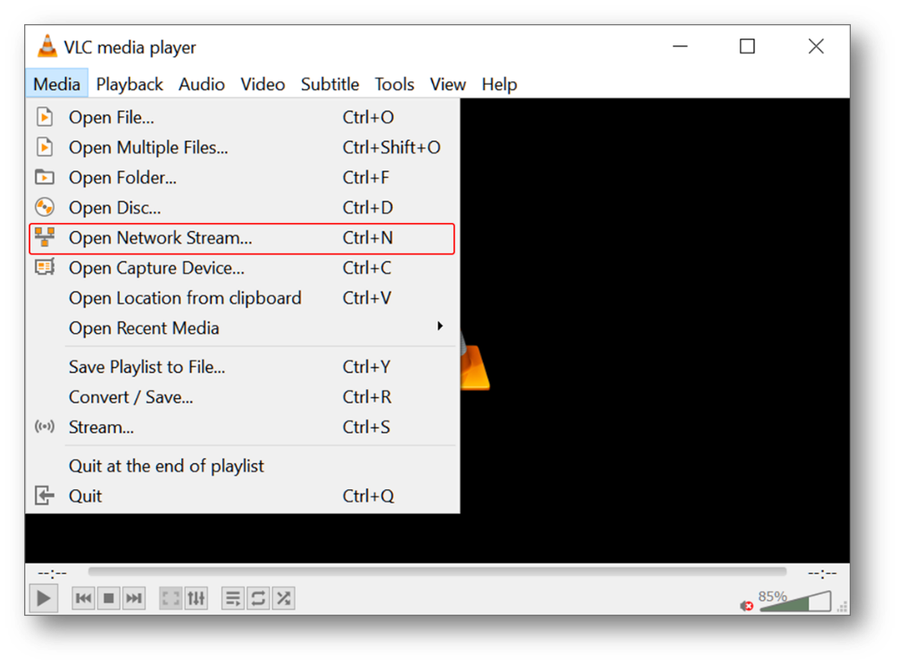After
installation, open VLC and select Media, then Open Network Stream…

### 

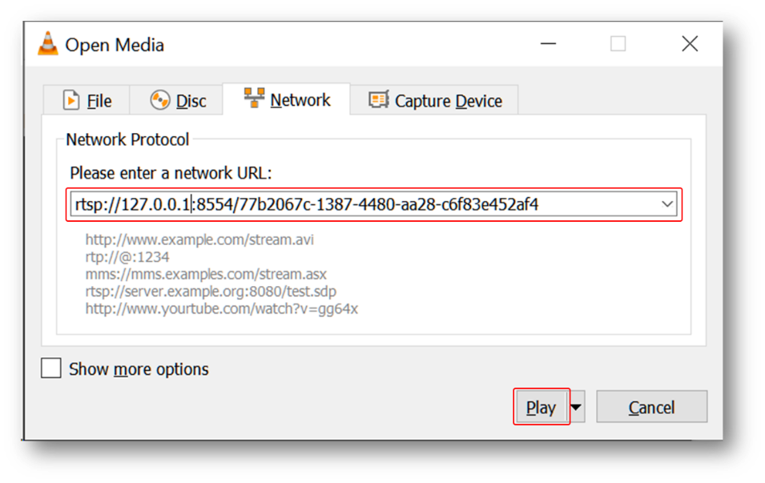Create the URL
for the video channel you intend to use and enter this in the <u>network
URL</u> text box. Use 127.0.0.1 or localhost when connecting locally
from the Streaming Engine server. Click Play.

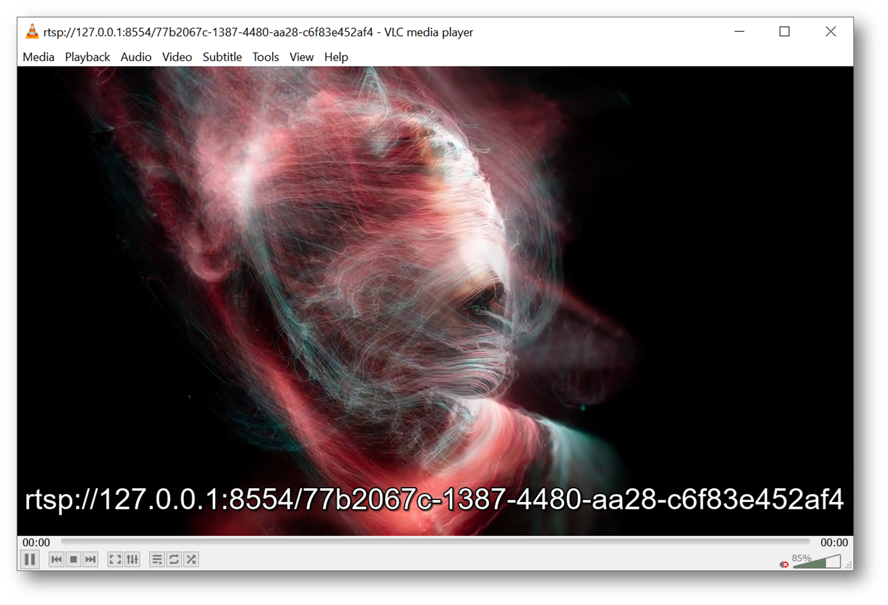The
video feed should now display in the VLC window.

To verify stream parameters, use Tools \> Codec Information.

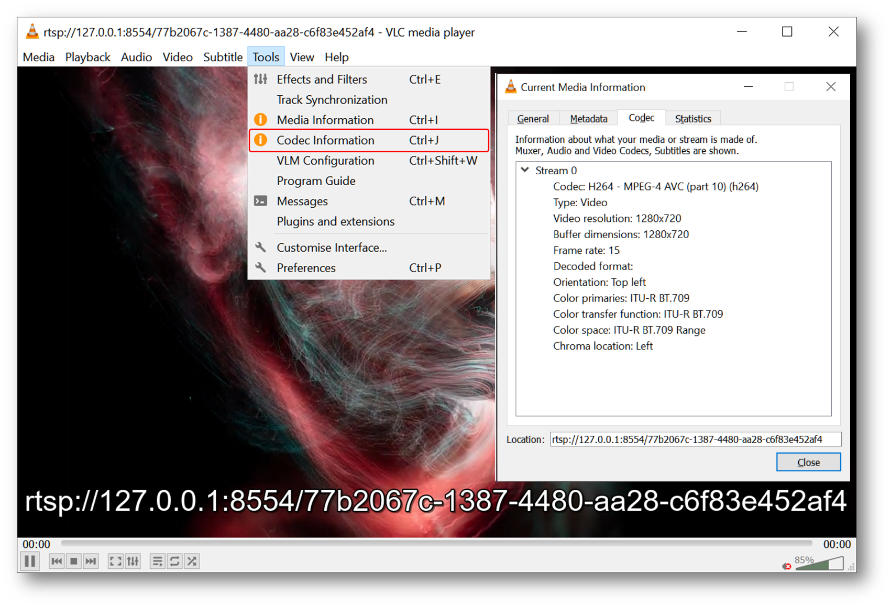

## Streaming – HLS

>  alt="Icon Description automatically generated" />HTTP Live Streaming
> (also known as HLS) is an HTTP-based adaptive bitrate streaming
> communications protocol developed by Apple Inc. and released in 2009.

Support for the protocol is widespread in media players, web browsers,
mobile devices, and streaming media servers. As of 2019, an annual video
industry survey has consistently found it to be the most popular
streaming format. (REF:
[Wiki](https://en.wikipedia.org/wiki/HTTP_Live_Streaming))

>  alt="Icon Description automatically generated" />HLS streaming best
> performs with H.264 or MJPEG streams. Ensure to select a Milestone
> stream that uses this codec type. Transcoding will occur if the wrong
> codec is selected and use additional system resources, mostly CPU.

<u>Stream to HLS</u> first set the <u>HLS file path local</u> then, Tick
to enable HLS Streaming.

<u>Selected Stream</u> The default stream for Milestone is <u>0</u>,
this is what would show live as default in the Smart Client.

<u>Automatic Transcoding</u> use only if the video used is not stable
when using for HLS. Try an alternative stream first.

<u>HLS filename path local</u> this location will need to be created and
set before you can enable HLS streaming. Go to
<u>C:\ProgramData\ORBNET\Streaming Engine\\</u> and create a new folder
called <u>\HLS\\</u> inside this folder you need to create a new folder,
copy the <u>camera channel GUID</u> for the name. Set the filename path
including the <u>stream.m3u8</u>. This file will be generated when HLS
is enabled.

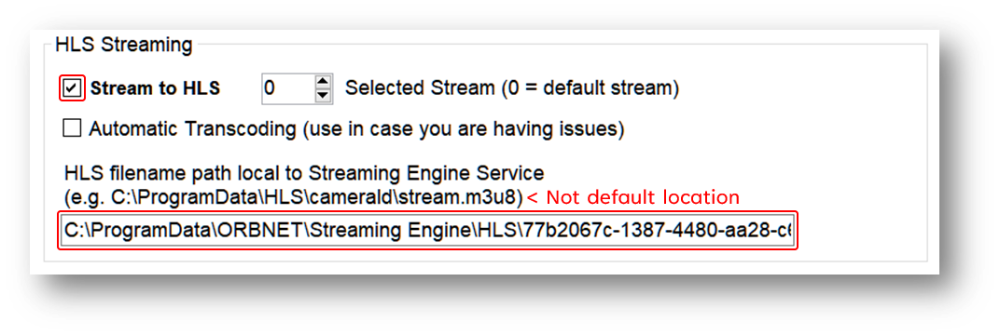Example: \[
C:\ProgramData\ORBNET\Streaming
Engine\HLS\77b2067c-1387-4480-aa28-c6f83e452af4\stream.m3u8 \] (This is
the default HLS file path, it must match the location listed in the
Streaming Engine settings, via the tray icon)

>  alt="Icon Description automatically generated" />After enabling HLS in
> the Streaming Engine settings restart the Streaming Engine service via
> the tray icon. This will reinitialize the channel and generate the HLS
> files required.

You will see now inside the newly created folder the stream.m3u8 and
three stream\*.ts files have been created.

Double click the stream.m3u8 file, this will be opened in <u>VLC
player</u> and display the HLS video stream to confirm this is working
correctly.

### **HLS Stream URL Formation**

URL = \[ http://\<streaming-engine-ip\>:\<port\>/API/HLS/Live
/\<camera-guid\>/\]

<u>http</u> = HLS being a web-based video streaming solution this uses
HTTP or HTTPS over SSL.

<u>\<streaming-engine-ip\></u> = The IP address of the server with the
Streaming Engine installed.

<u>\<port\></u> = As default the port used is 45333, 45334 if using HLS
over SSL.

<u>/api/hls/</u> = This is delivered by the Streaming Engine API with
HLS used as our streaming parameter.

<u>/Live</u> = This is used to specify the stream requirement for
display.

<u>\<camera-guid\></u> = The unique camera channel identifier copied
from the Streaming Engine tab.

<u>http://192.168.0.100:45333/API/HLS/Live/d4a9f84a-a554-4064-a867-eb1d59248c77/</u>

This is the URL in its most basic form.

<u>https://91.37.144.121:45334/API/HLS/Live/d4a9f84a-a554-4064-a867-eb1d59248c77/</u>

In this URL an external IP address has been used, this requires a port
forward on a firewall to be setup for (port 45334).

### **HLS URL Test**

Open VLC Player and select Media, then Open Network Stream…

Create the URL for the video channel you intend to use and enter this in
the <u>network URL</u> text box. Use 127.0.0.1 or localhost when
connecting locally from the Streaming Engine server. Click Play.

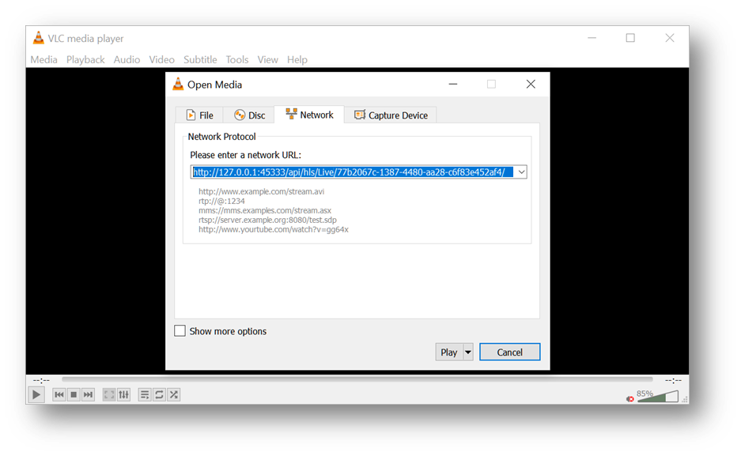

### **HLS Webpage Example**

Once we have established that video stream works with the stream.m3u8
file and HTTP stream request, we are able to take this video stream to a
web page.

Below is a HTML code example that will display the HTTP or HTTPS source
in a webpage.

This example uses a
java script from <https://www.jsdelivr.com/>

HLS.js is released under [Apache 2.0 License](https://github.com/video-dev/hls.js/blob/master/LICENSE)

\<!DOCTYPE html\>

\<html lang="en"\>

\<head\>

\<meta charset="utf-8" /\>

\<meta name="viewport" content="width=device-width, initial-scale=1"\>

\<title\>Play HLS\</title\>

\</head\>

\<body\>

\<script src="https://cdn.jsdelivr.net/npm/hls.js@1"\>\</script\>

\<video id="video" controls preload="auto"\>\</video\>

\<script\>

var video = document.getElementById('video');

var videoSrc =
**'<u>http://127.0.0.1:45333/api/hls/Live/77b2067c-1387-4480-aa28-c6f83e452af4/</u>'**;

if (Hls.isSupported()) {

var hls = new Hls();

hls.loadSource(videoSrc);

hls.attachMedia(video);

}

else if (video.canPlayType('application/vnd.apple.mpegurl')) {

video.src = videoSrc;

}

\</script\>

\</body\>

\</html\>

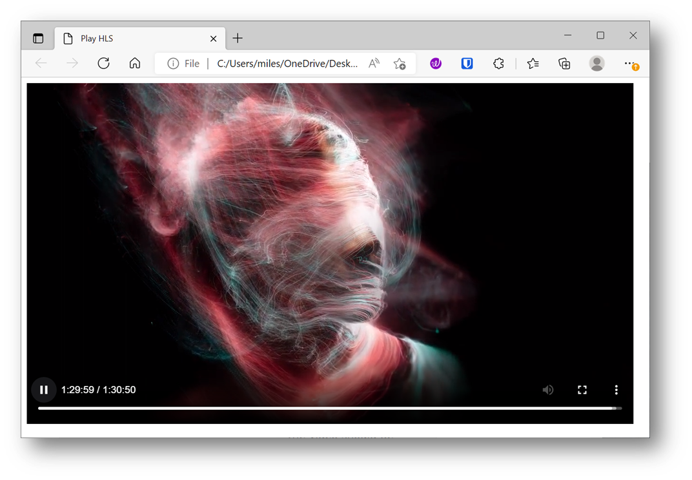

## Streaming – RTMP

> RTMP stands for real-time messaging protocol. It provides for
> high-performance transmission of audio, video, and data from an
> encoder to a server, which distributes the signal across the

Internet. Many streaming providers and encoder developers support RTMP
streaming, including Livestream. (REF:
[LiveStream](https://help.livestream.com/hc/en-us/articles/360002052068-What-is-RTMP-Cloud-Transcoding-))

>  alt="Icon Description automatically generated" />RTMP streaming best
> performs with H.264 or H.265 streams. Ensure to select a Milestone
> stream that uses this codec type. Transcoding will occur if the wrong
> codec is selected and use additional system resources, mostly CPU.

<u>Stream to RTMP</u> first set the <u>Stream URL and key</u> then, Tick
to enable RTMP Streaming.

<u>Selected Stream</u> the default stream for Milestone is 0, this is
what would show live as default in the Smart Client.

<u>Automatic Transcoding</u> use only if the video used is not stable
when using for HLS. Try an alternative stream first.

<u>Stream URL and Key</u> this URL and key is gathered from the video
sharing platform (i.e. YouTube). This is what is used to send the video
stream to the internet.

<u>Select Resume Event …</u> this allows the use of a Milestone user
defined event to control the sending state of the video stream to the
video sharing platform.

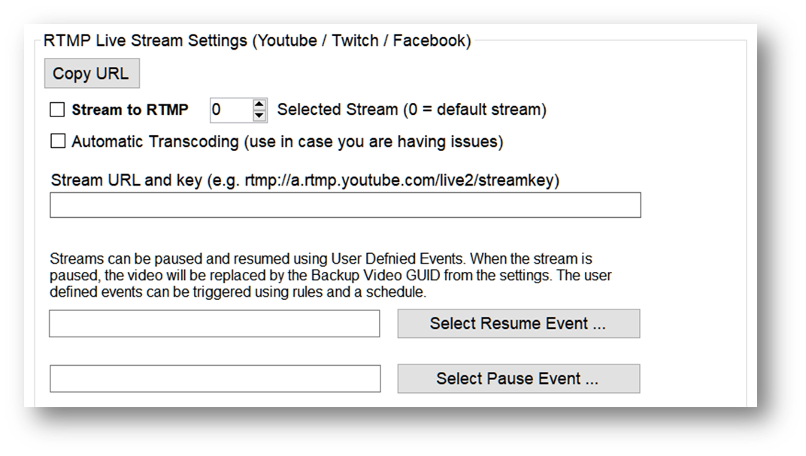<u>Select Pause Event
…</u> as above

### **RTMP Stream Testing**

Video Sharing Platforms that support RTMP come in all sorts of shapes
and sizes. Methods of testing may differ from one platform to another.
In this example we will use <u>YouTube Studio</u>, the steps are similar
to many other streaming platforms.

>  alt="Icon Description automatically generated" />YouTube as a 24-hour
> verification process to access Live Streaming. Before you can run this
> as a test this verification process will need to be completed first.

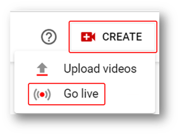Go to
<https://studio.youtube.com/> and select Create then Go Live

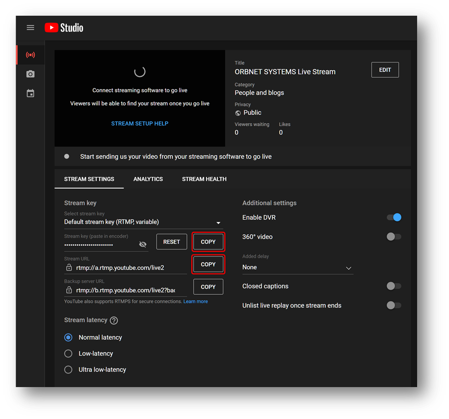The page that follows allows connection of
a video stream to start video streaming online. Copy the Stream URL into
settings, add / to the end of the URL. Copy the Stream key and add to
the end.

Under <u>Streaming engine settings</u> add the <u>Stream URL</u>
followed by a forward slash (“/”) and the <u>Stream key</u>. Tick
<u>Stream to RTMP</u> to enable the stream to be sent to the video
sharing platform.

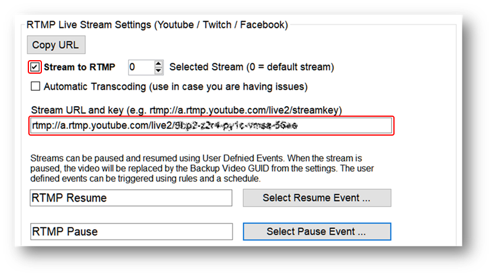

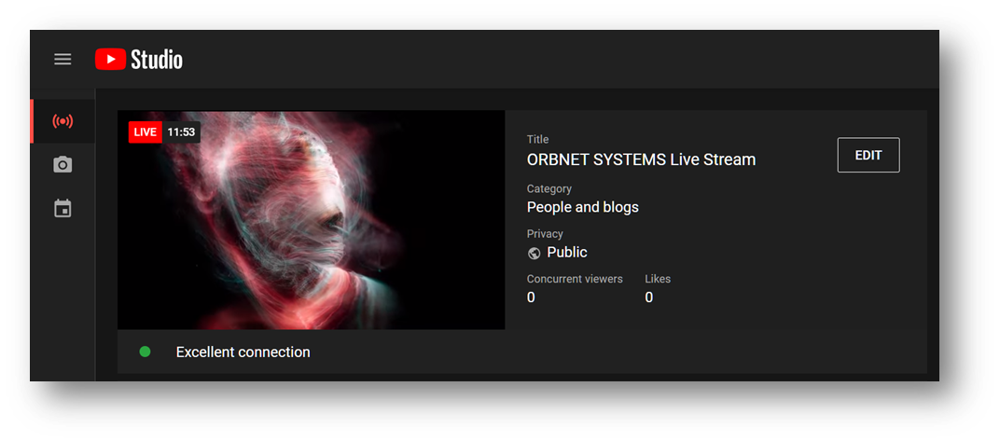Now enabled
the connection will be established and YouTube will show the video as
Live.

>  alt="Icon Description automatically generated" />The Streaming Engine
> supports many video sharing platforms that support RTMP. Other systems
> will be covered in either a dedicated how-to guide or a website
> knowledge base item.

We are always expanding our support for other system, please contact
<support@orbnetsys.com> if you need further information or assistance
with your application / solution.

**  
**

### **RTMP YouTube API**

Support of the YouTube API has been built into the Streaming Engine.
Once enabled this provides an easy-to-use method to manage multiple
streams. This takes away the process of manually entering the Stream URL
and managing multiple Stream Keys. Live Streaming to YouTube can be
completed with the click of a button once connected.

>  alt="Icon Description automatically generated" />All the YouTube API
> setup steps will be covered in detail in a dedicated how-to guide.
> Please look out for this here. <https://orbnetsys.com/streamingengine>

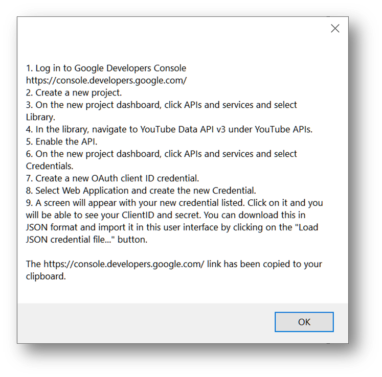
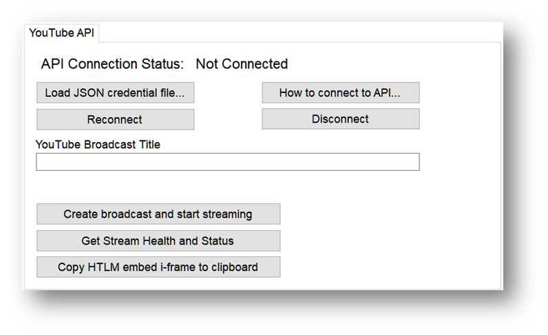

### **RTMP Pause and Resume Events**

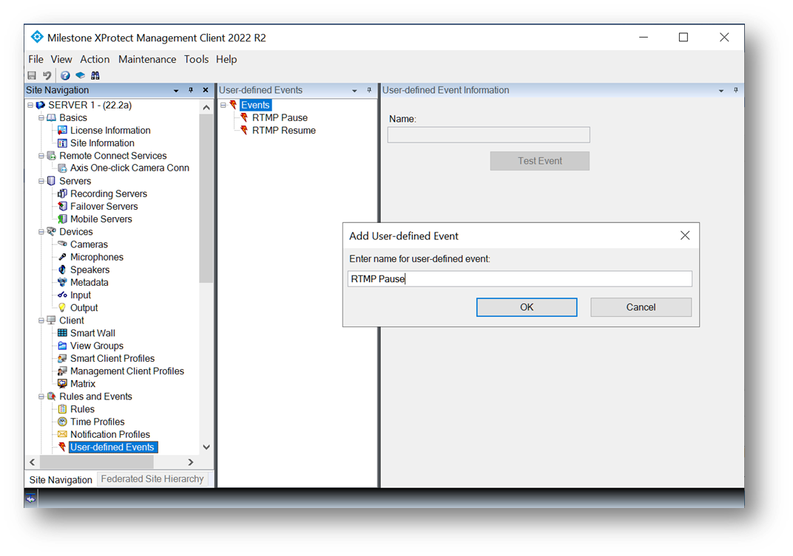Under
<u>Rules and Events</u>, select <u>User-defined Events</u>. Add a new
Event for Pause and Resume. These are defined for each device in the
Streaming Engine settings, so if you need to control each device
independently create a User-defined event for each camera with RTMP
enabled. As an example, you could use RTMP Pause - \<camera-name\> ,
RTMP Resume - \<camera-name\> .

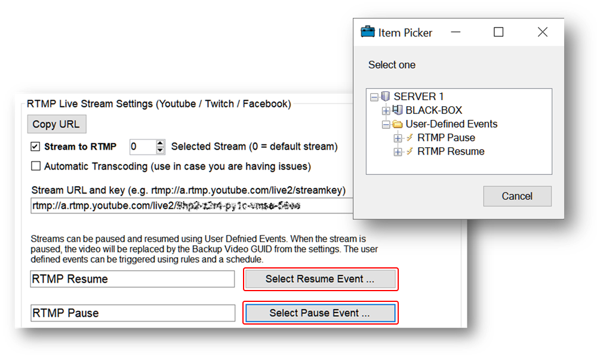

Select the Resume and Pause events using the

<u>Item Picker</u>.

## Streaming – MJPEG

> Motion JPEG or MJPEG (MJPG) is a video format in which video frames
> are compressed individually as JPEG images. The format is widely used
> by digital cameras, webcams, and other video recorders and is
> supported by most web browsers. (REF:
> [movavi](https://www.movavi.io/mjpeg-codec-2/))
>
>  alt="Icon Description automatically generated" />MJPEG streaming best
> performs with MJPEG streams. Ensure to select a Milestone stream that
> uses this codec type. Transcoding will occur if the wrong codec is
> selected and use additional system resources, mostly CPU.

MJPEG streaming is a new implementation in the Streaming Engine via the
API. There are currently no settings available in the Streaming Engine
settings tab. The stream is built upon the URL requested.

### **MJPEG Stream URL Formation**

URL = \[
http://\<streaming-engine-ip\>:\<port\>/API/MJPEG/\<camera-guid\>/Live
\]

<u>http</u> = MJPEG over HTTP being a web-based video streaming solution
this uses HTTP or HTTPS over SSL.

<u>\<streaming-engine-ip\></u> = The IP address of the server with the
Streaming Engine installed.

<u>\<port\></u> = As default the port used is 45333, 45334 if using
MJPEG over SSL.

<u>/api/mjpeg/</u> = This is delivered by the Streaming Engine API with
MJPEG used as our streaming parameter.

<u>\<camera-guid\></u> = The unique camera channel identifier copied
from the Streaming Engine tab.

<u>/Live</u> = This is used to specify the stream requirement for
display.

As default the
requested stream is 640x480 (or per aspect ratio) at 2FPS.

### **MJPEG Additional URL parameters**

>  alt="Icon Description automatically generated" />When using these
> additional URL parameters all parts of the URL that follow need to be
> completed with the /live to complete the URL.

After the <u>\<camera-guid\></u> the Streaming Engine will support the
additional parameters below.

\[ …/\<stream\>/\<fps\>/\<resolution\>/live \]

\[ …/\<stream\> \]

<u>\<stream\></u> = Lookup of Stream name value (spaces allowed, by
using ‘ %20’ in place of the spaces).

In the below example we have an Axis IP camera, this has eight streaming
channels. The <u>\<stream\></u> is determined by the <u>Stream</u> name
in Milestone, shown on the left in the below example. We need to take
something unique from this name \[**<u>Video stream 2</u>**\] or use the
full name with ‘ %20’ in place of the spaces.

\[ …/2 \]

\[ …/video%20stream%202 \]

>  alt="Icon Description automatically generated" />For other devices the
> naming can differ, instead of default name of \[**<u>Video stream
> 1</u>**\] this might be \[**<u>JPEG</u>**\] in this case this would be
> what is used.

\[ …/JPEG \]

>  alt="Graphical user interface Milestone XProtect" /> alt="Icon Description automatically generated" />When using sub-video
> streams ensure the video stream to be used is included in the Streams
> tab as a secondary stream. Update Live Mode for this video stream to
> Always, without this enabled the video stream is not made available as
> live to the Streaming Engine from Milestone.

<u>http://192.168.0.100:8554/63c02a95-4d86-4d63-95ac-b3b755784c7d/2</u>

<u>http://192.168.0.100:8554/63c02a95-4d86-4d63-95ac-b3b755784c7d/JPEG</u>

<u>http://192.168.0.100:8554/63c02a95-4d86-4d63-95ac-b3b755784c7d/video%20stream%202</u>

This would be the full URL with the stream parameter.

\[ …/\<stream\>/\<fps\> \]

<u>\<fps\></u> = This indicates the frames per second used for the MJPEG
stream.

>  alt="Icon Description automatically generated" />For the best
> performance match the frames per second used by the stream in
> Milestone. Check the camera channel settings, for some cameras this is
> set in the web interface.

<u>http://192.168.0.100:8554/63c02a95-4d86-4d63-95ac-b3b755784c7d/2/15</u>

This is an example with 15FPS set for the MJPEG stream.

\[ …/\<stream\>/\<fps\>/\<resolution\> \]

<u>\<resolution\></u> = This indicates the resolution used for the MJPEG
stream. Use \<width\>x\<height\> to set this parameter.

>  alt="Icon Description automatically generated" />For the best
> performance match the resolution used by the stream in Milestone.
> Check the camera channel settings, for some cameras this is set in the
> web interface. The performance

will be less affected by a change to the resolution but ensure the
aspect ratio matches the stream used so the stream displays best.
([Aspect Ratio Calculator (ARC)
(hedges.name)](https://andrew.hedges.name/experiments/aspect_ratio/))

<u>http://192.168.0.100:8554/63c02a95-4d86-4d63-95ac-b3b755784c7d/2/15/1280x720</u>

This is an example with the resolution set to a width of 1280 and a
height of 720 (16:9 aspect ratio).

\[ …/\<stream\>/\<fps\>/\<resolution\>/live \]

/live = This completes the URL and will allow the stream to connect.

### **MJPEG URL Test**

Open VLC Player and select Media, then Open Network Stream…

Create the URL for the video channel you intend to use and enter this in
the <u>network URL</u> text box. Use 127.0.0.1 or localhost when
connecting locally from the Streaming Engine server. Click Play.

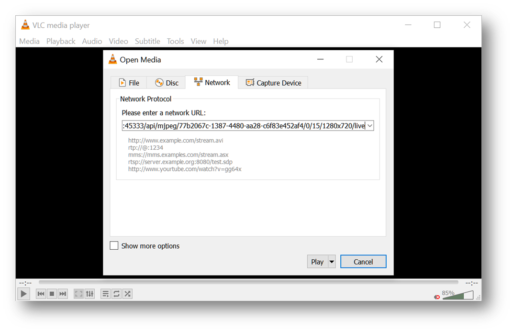

### **MJPEG Webpage Example**

Once we have established that video stream works via a HTTP stream
request, we are able to take this video stream to a web page.

>  alt="Icon Description automatically generated" />MJPEG has great
> browser support, the HTML code used is very simple. Displaying a MJPEG
> video is the same code used to display an image on a web page.

Below is a very basic HTML code example that will display the HTTP or
HTTPS source in a webpage.

\<!DOCTYPE html\>

\<html lang="en"\>

\<head\>

\<meta charset="utf-8" /\>

\<meta name="viewport" content="width=device-width, initial-scale=1"\>

\<title\>Play MJPEG\</title\>

\</head\>

\<body\>

\http://192.168.0.13:45333/api/MJPEG/77b2067c-1387-4480-aa28-c6f83e452af4/Live</u>"**\>

\</body\>

\</html\>

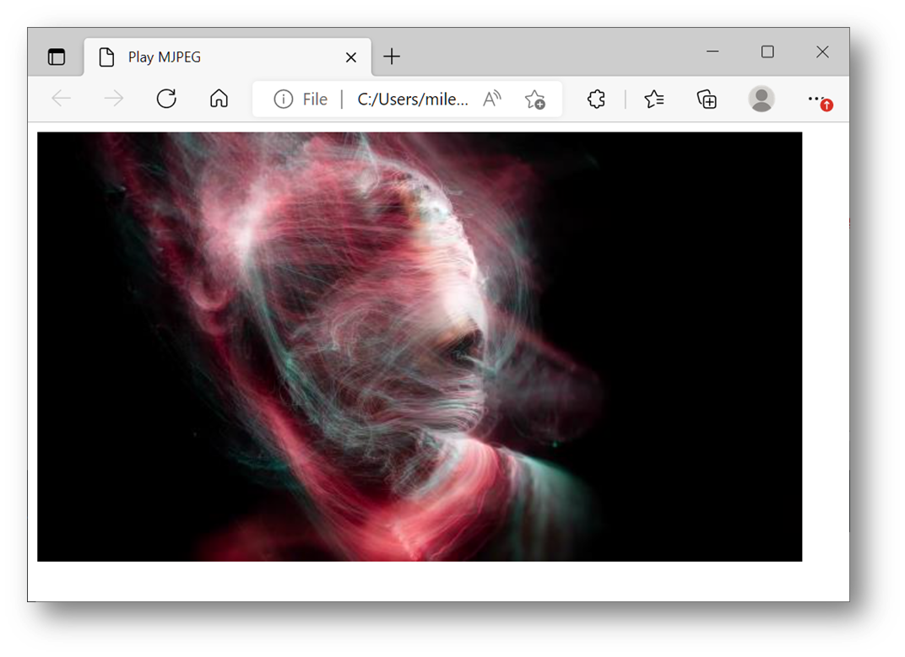

This below example is our advance HTML code example. This creates a full
screen 4-way tile layout. This best suite an installation with the
<u>Milestone Management Server</u> and <u>Streaming Engine</u> on the
same machine as this utilizes the already installed <u>Microsoft IIS</u>
web service.

Create a HTML file with the code below and make changes to only the
sections highlighted in red. Once updated move the file to
C:\inetpub\wwwroot\\ on the <u>Milestone Management Server</u>.

Note down the full file name of your HTML file then in a browser enter
<u>http://localhost/\<file-name\></u> or
<u>https://localhost/\<file-name\></u> . This page will be accessible
across the network in the same way
<u>http://\<server-ip\>/installation</u> is available for installation
of the Client applications.

>  alt="Icon Description automatically generated" />Files in \wwwroot\\
> are protected from editing, to change the HTML file, copy the file to
> a local directory edit then drop the file back and replace. Refresh
> the page to show the changes.

This example uses a
java script from <http://www.stacksnippet.com/>

This is a debug element for java and shows errors in the code.

\<!DOCTYPE html\>

\<html lang="en"\>

\<head\>

\<meta charset="utf-8" /\>

\<meta name="viewport" content="width=device-width, initial-scale=1"\>

\<style\>

body {height: 100%; overflow: hidden; padding: 0; margin: 0;}

img {height: 100%; width: 100%}

div {position: fixed; width: 50%; height: 50%; border: 1px solid \#fff;}

\#NW {top: 0; left: 0; background: orange;}

\#NE {top: 0; left: 50%; background: blue;}

\#SW {top: 50%; left: 0; background: green;}

\#SE {top: 50%; left: 50%; background: red;}

\</style\>

\<script
src="https://stacksnippets.net/scripts/snippet-javascript-console.min.js?v=1"\>\</script\>

\</head\>

\<body\>

\
\\</div\>

\
\\</div\>

\
\\</div\>

\
\\</div\>

\<script type="text/javascript"\>

// Stream Details

const videostream = **"<u>0</u>"**;

const videofps = **"<u>15</u>”**;

const videoresolutionlink = "1280x720";

// Stream Details End

// Stream GUID

const stream01 = **"<u>77b2067c-1387-4480-aa28-c6f83e452af4</u>"**;

const stream02 = **"<u>63c02a95-4d86-4d63-95ac-b3b755784c7d</u>"**;

const stream03 = **"<u>c22daebe-a584-492a-913a-e1d9575fcbcd</u>"**;

const stream04 = **"<u>9b6fcead-6392-4564-a7c8-21674d598887</u>"**;

// Stream GUID End

let host = location.protocol;

let apiport;

if (host == "http:") {

apiport = "45333";

} else if (host == "https:") {

apiport = "45334";

} else {

apiport = "ERROR!";

}

const serveripport = location.protocol + "//" + location.host + ":" +
apiport;

const apicodec = "/api/MJPEG/";

const videostreampull = "/" + videostream + "/" + videofps + "/" +
videoresolutionlink + "/Live";

const stream01live = serveripport + apicodec + stream01 +
videostreampull;

const stream02live = serveripport + apicodec + stream02 +
videostreampull;

> const stream03live = serveripport + apicodec + stream03 +
> videostreampull;
>
> const stream04live = serveripport + apicodec + stream04 +
> videostreampull;
>
> function update(className, property, value) {
>
> Array.from(document.getElementsByClassName(className)).forEach(elem
> =\> (elem\[property\] = value))

}

update("stream01live", "src", stream01live)

update("stream02live", "src", stream02live)

update("stream03live", "src", stream03live)

update("stream04live", "src", stream04live)

\</script\>

\</body\>

\</html\>

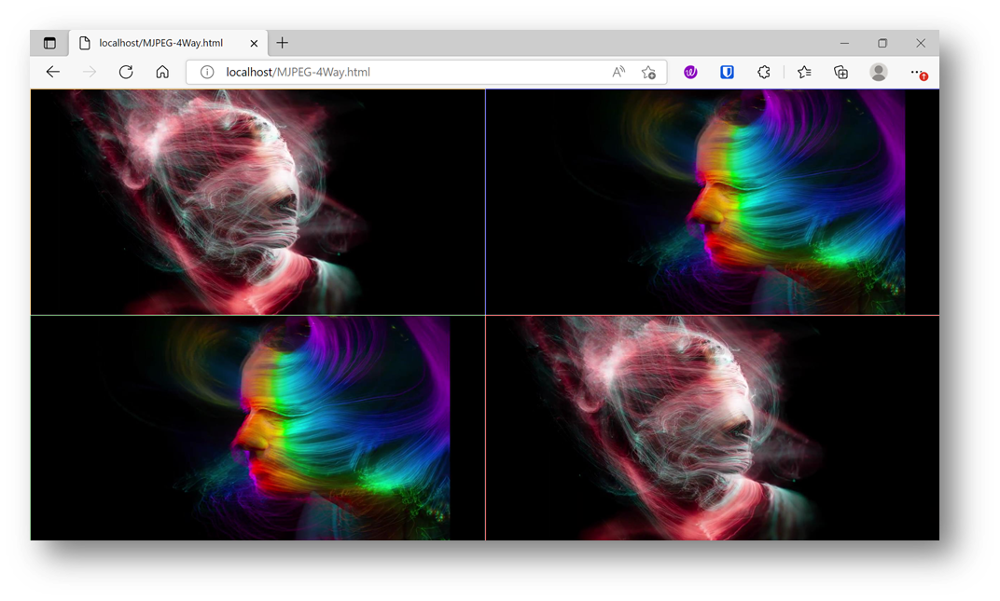

## Timelapse & Auto-Snapshots

Under the <u>Streaming Engine settings</u> tab in the Management
Application select the sub-tab within the settings page for Timelapse &
Auto-Snapshots to access the additional settings.

### Timelapse & Auto-Snapshots Guidance

Enabling this timelapse feature will copy an image to the selected
folder and auto-increment the filename so that you can use another
program to build a timelapse video. Please make sure each camera channel
timelapse is set to a different folder.

- NVIDIA decoding is supported.

- Network drives are supported.

  - Be sure to check write speeds of network locations, this can cause
    high CPU if not able to replace files before a file is written to a
    location.

- Path is relative to the Streaming Engine, not to this Management
  client.

- Please make sure the Streaming Engine service account has read/write
  access to the selected folder.

  - Ensure you check the files are being written to disk.

- Please set the image width and height manually.

  - Check the image size in Milestone, if using a different size check
    the aspect ratio matches the stream used so the image displays best.
    ([Aspect Ratio Calculator (ARC)
    (hedges.name)](https://andrew.hedges.name/experiments/aspect_ratio/))

- Each checkbox will log JPEGs to a separate folder (Timelapse, On
  Event, On Motion).

- You can use the Rules to take snapshots by triggering User-defined
  Events using a recurring schedule.

### Timelapse & Auto-Snapshots Settings

First set the <u>Snapshot Destination folder local to Streaming
Engine</u> by selecting Browse…

A separate folder will be created for each selected feature (Timelapse,
On Event, On Motion).

Set the image resolution by changing <u>Image Width</u> and <u>Image
Height</u> (default: 1920x1080).

<u>Examples:</u>

(16:9) 320x180, 640x360, 720x567, 1280x720, 1920x1080, 3840x2160

(4:3) 320x240, 640x480, 768x576, 1280x960, 1920x1440, 3840x2880

<u>Keep Stream Open</u> (will generate less Audit logs but use more
resources)

This keeps the video stream open in the Steaming Engine service. This is
best used when snapshots are set to be taken multiple times a minute.

<u>Save Method</u> (Dropdown menu)

- <u>Default</u> – New file created for each snapshot event

- <u>NewDayNewFolder</u> – New file created in separated day folders

- <u>Overwrite</u> – A single image file is overwritten with the latest
  saved file each time the timer
  elapses.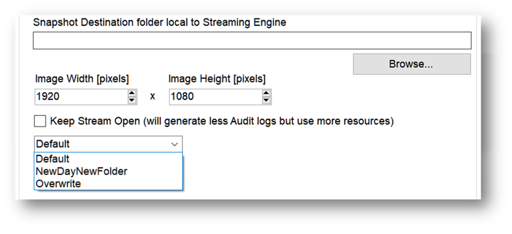

### Timelapse Settings

<u>Timelapse Enabled</u> (Tick option) – Tick to enable Timelapse to the
relevant folder selected

<u>Save picture every</u> \<min\> <u>minutes and</u> \<sec\>
<u>seconds</u> – Set the time between images

 \* Seconds must be
bigger than zero before you can set the minutes to zero.

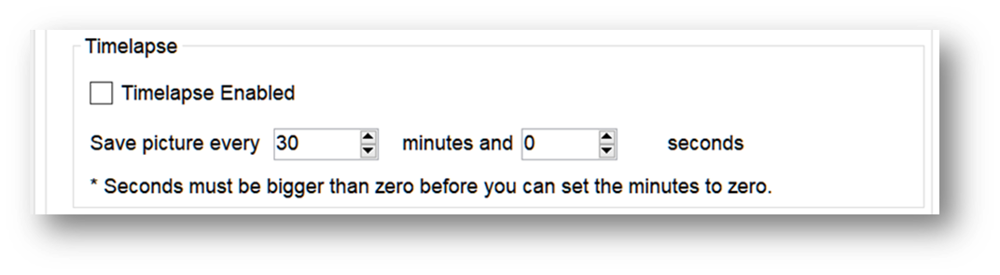

### Snapshot on Event Settings

<u>Snapshot on Motion Start</u> (Tick option) – Tick to enable, this
camera must have default Milestone motion detection setup

<u>Snapshot on User Defined Event</u> (Tick option) – Tick to enable,
select a relevant event to use as the trigger for this option

<u>User Defined Event selection</u> - Press Select Event ... to add the
event assigned to the <u>Snapshot on User Defined Event</u> option

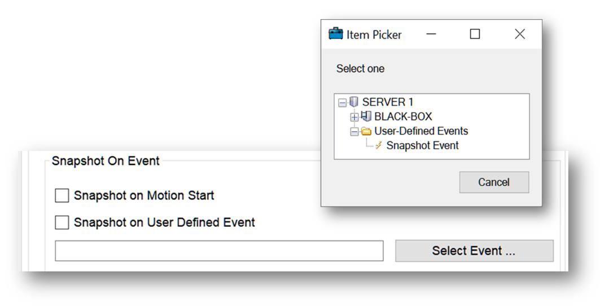

## Stream Ingest – RTSP into Milestone

This section outlines the method of sharing a video feed from one
Milestone system to another. As shown in <u>Method: ORB Driver to
Milestone</u>. This is where the Streaming Engine is used to generate a
RTSP video stream at a second Milestone installation uses the [ORB
Driver](https://orbnetsys.com/ORBDriver) (provided by ORBNET Systems) to
connect to this video stream.

This allows a video source from any paid for Milestone XProtect version
to be setup into another Milestone instance, much like [Milestone
Interconnect™](https://www.milestonesys.com/solutions/hardware-and-add-ons/milestone-addons/interconnect/)
without the need for a Corporate head end.

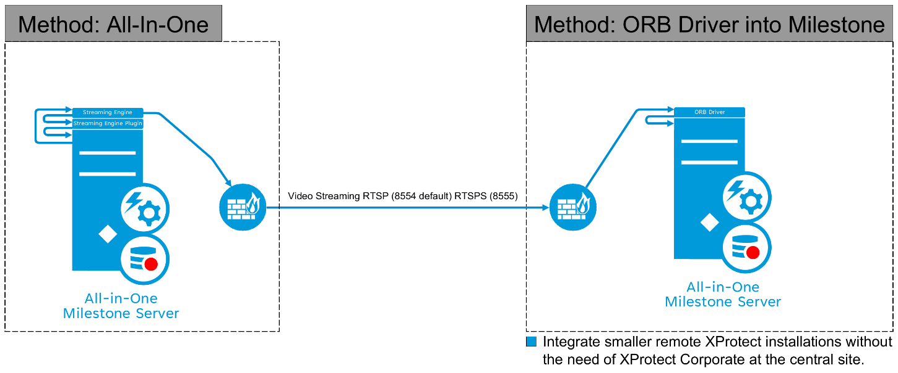

Following the guidance for [RTSP Stream](#_Streaming_–_RTSP) setup from
this document and the stream will be ready to connect to the second
Milestone instance. Add the stream URL in the channel settings (ORB
Driver).

>  alt="Icon Description automatically generated" />Please follow the ORB
> Driver Installation and User Guide for further detailed information on
> how to add and setup a video source in Milestone.
>
> 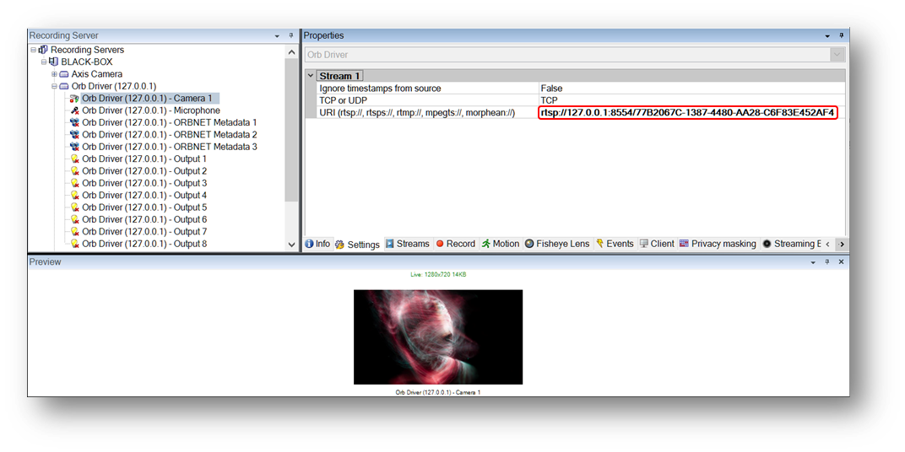 alt="Graphical user interface Milestone XProtect Video Credit: Epic Cinematic" />

## Stream Ingest – RTMP into Milestone

This section outlines the method of ingesting RTMP from other external
systems / devices. This could be from Drones, mobile phones, screen
sharing software, anything that supports RTMP live streaming. This is
where the Streaming Engine is used as a RTMP Proxy to receive an RTMP
video stream. Then using the [ORB
Driver](https://orbnetsys.com/ORBDriver) (provided by ORBNET Systems)
you will be able to connect to this video stream.

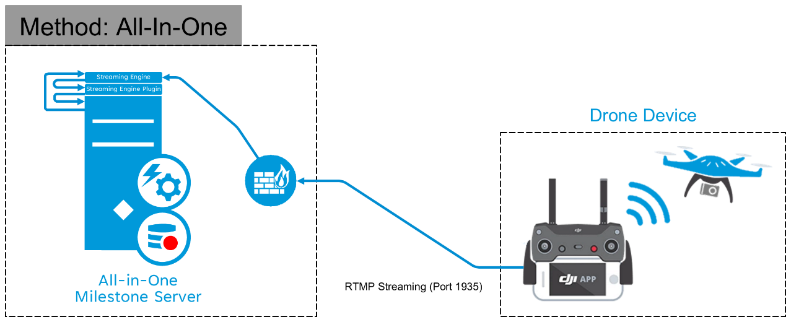

The RTMP URL is the external IP address of the Streaming Engine plus the
default RTMP port (**1935**). Use a custom stream key of your choosing
(example “hd3a25w3tzf2”). Use a [password
generator](https://www.lastpass.com/features/password-generator),
removing Uppercase and Symbols.

URL = \[ rtmp://\<streaming-engine-ip\>/live/\<stream-key\> \]

For this example, we will use the [DJI Go 4
app](https://www.dji.com/uk/downloads/djiapp/dji-go-4).

From <u>General Settings</u> select Choose Live Streaming Platform,
select RTMP Custom, Enter the <u>RTMP URL</u> with the custom Stream
Key, click Next then Start to begin live streaming.

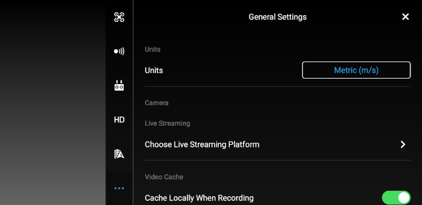
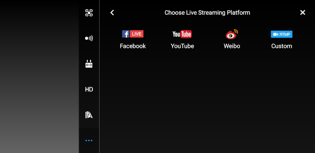

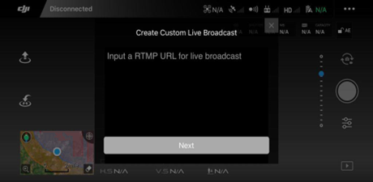
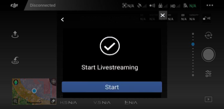

Once the RTMP stream is received by the Streaming Engine the video
channel is restreamed as a RTSP channel. The URL for this channel is the
IP of the local Streaming Engine instance, plus the stream key used in
the previous step.

URL = \[ rtsp://\<streaming-engine-ip\>:8554/\<stream-key\> \]

From the ORB Driver device, select the video channel, then the Settings
tab, Add the stream URL in the channel settings.

>  alt="Icon Description automatically generated" />Please note that
> there is a ‘/live’ parameter necessary in the RTMP URL but that must
> **not** be included in the RTSP URL.
>
>  alt="Icon Description automatically generated" />Please follow the ORB
> Driver Installation and User Guide for further detailed information on
> how to add and setup a video source in Milestone.

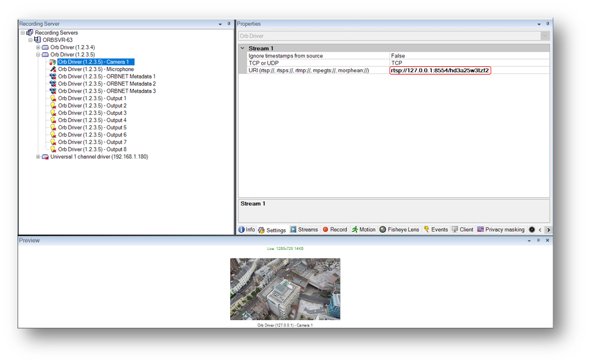

## Stream Ingest – MP4 to Web

This section outlines a method of using the streaming engine to stream
an <u>MP4 video file</u> over <u>HTTP</u>.

Any <u>MP4 video file</u> can be streamed in a browser if it is placed
in this hardcoded location:

C:\ProgramData\ORBNET\Streaming Engine\MP4\\ (The MP4 folder must be
created)

**MP4 Stream URL
Formation**

URL = \[
http://\<streaming-engine-ip\>:\<port\>/API/MP4/\<video-filename\> \]

Example: http://127.0.0.1:45333/api/MP4/pixelated-3d-logo-video.mp4

Navigate to the URL in a browser or use the example HTML page below.

### **MP4 Webpage Example**

This is a basic webpage example for showing the MP4 file in a web
browser.

\<!DOCTYPE html\>

\<html\>

\<head\>

\<meta charset=utf-8 /\>

\<meta name="viewport" content="width=device-width, initial-scale=1"\>

\<title\>Play Mp4\</title\>

\</head\>

\<body\>

\<video autoplay controls muted loop\>

\<source
src=**"<u>http://127.0.0.1:45333/api/MP4/pixelated-3d-logo-video.mp4</u>"**
type="video/mp4" /\>

\</video\>

\</body\>

\</html\>

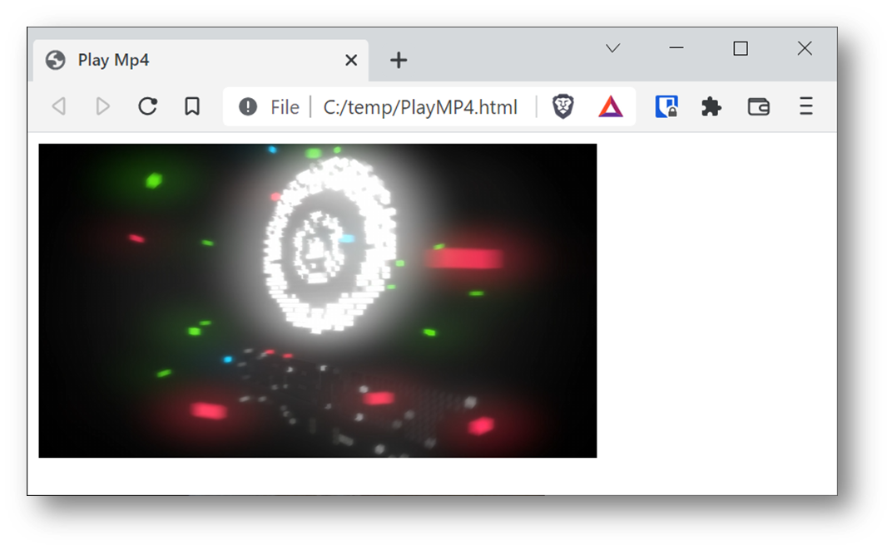

# Advance Streaming Engine Settings

Find the Streaming Engine Manager in the taskbar. If the task icon is
not showing, check that it is not hidden in the system tray or run from
the desktop shortcut to open.

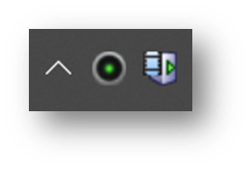

Right click the tray icon and select Change
settings…

Service Restart
confirmation, Click Yes

Finish your configuration changes then exit with the cross at the top
right of this window. You will get a message “Config saved!”

## API Settings

This is a service built into the Streaming Engine that provides channel
information via API calls. This would best suit a third-part application
that is able to receive custom commands. The API service also handles
MJPEG and HLS Streams.

<u>API External IP</u> Certain API requests will respond with a stream
URL. Use this field to determine which IP address (local or public IP)
will appear in the responses when requesting streams via the API.

<u>API Port</u> default port of <u>45333</u>, used for API connections
to the Streaming Engine

<u>API Port</u> (Secure) default port of <u>45334</u>, used for API
connections to the Streaming Engine

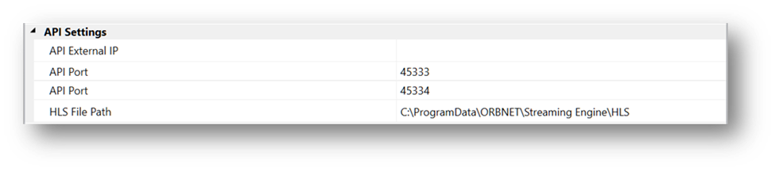

## Milestone Connection Settings

These settings relate to the local instance of Milestone the Streaming
Engine will be connected to.

<u>Log in with service account credentials</u> (See [**Changing a
service account**](#changing-to-a-service-account) in this document)

*\[Uses the windows account that is running the “ORBNET Streaming
Engine” service to login to Milestone. If set to true, you must change
the service user from “Network Service” to a domain service account of
your choosing and add the service account to Milestone security
roles.\]*

<u>Milestone Basic User</u> (See [**Basic user
setup**](#basic-user-setup) in this document)

*\[This is a uses a Milestone created basic user account, the account
needs to be added to a relevant Milestone security role. Only works if
“Log in with service account” is set to false.\]*

Fill out the correct <u>Milestone Management Server IP</u> address and
port.

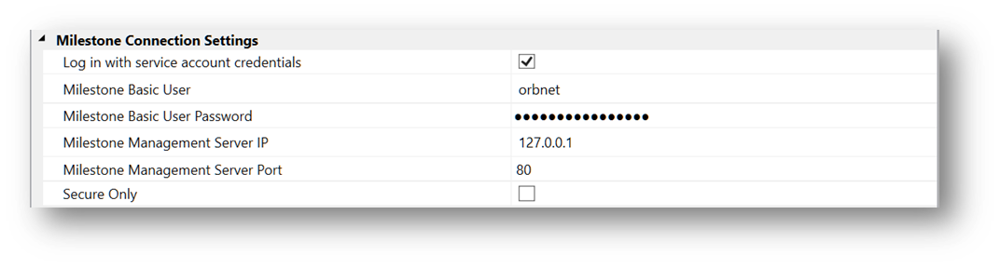Tick <u>Secure Only</u> if you have
installed Milestone using a Management Server certificate.

## ORBSS Settings

ORBSS is an internal system of the Streaming engine that offers an
additional layer of security for proxying streams through more than one
Streaming Engines. This feature can be used to re-stream unsecure
cameras securely through a chain of Streaming Engines.

<u>Authorized IP or Hostnames</u> when an IP or hostname is entered
(<u>one per line</u>) the streaming engine will only allow Streaming
Engines with these IP addresses to pull streams through it.

<u>ORBSS Encryption Key</u> this is used to encrypt video data between
two instances of the Streaming Engine. This is where the second instance
of the Streaming Engine is used as a proxy for the transmitting
Streaming Engine instance. The encryption key must be the same on both
sides for the ORBSS stream encryption to be active.

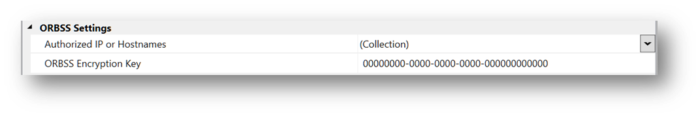

## RTSP Server Settings

These options allow for a fine level of RTSP advance setting changes.

<u>Brutal Socket Termination</u> this will terminate any clients trying
to connect to prohibited cameras.

<u>Close Broken Streams</u> the stream does not teardown if Milestone
loses the connection to the cameras stream. Only use this if your
streaming client does not shutdown or re-initialize when a camera feed
is lost and comes back online.

<u>FFMPEG Export path</u> the Streaming Engine will store video clips
here when they are export from the Streaming Engine Smart Client Plugin

<u>Keep Alive Timeout in seconds</u> (<u>0 = no timeout</u>) Number of
seconds before the Streaming Engine will teardown a requested feed if no
RTSP keep alive (<u>GET_PARAMETER / SET_PARAMETER</u>) is received. Set
this value to 120 seconds if working exclusively with UDP.##

<u>Log Statistics Period</u> (Seconds) number of seconds between logging
of statistics on each active stream.

<u>RTSP Server Port</u> default port of <u>8554</u>, this is used when
establishing RTSP connections

<u>RTSP Server SSL Port</u> default port of <u>8555</u>, this is used
when establishing secure RTSP connections

<u>Separate NAL Units</u> video streams over RTSP send packets over the
internet in groups of frames or NAL units. Setting this parameter will
send all video frames over the network frame by frame. Set this
parameter to true if your streaming client has issues or artifacts while
decoding frames from certain cameras.

<u>Use Milestone timestamps</u> use this parameter to let the Streaming
Engine generate the RTSP timestamps instead of re-using the timestamps
stored in Milestone. Set this parameter to true if you are experiencing
late frame decoding errors due to faulty Milestone drivers.

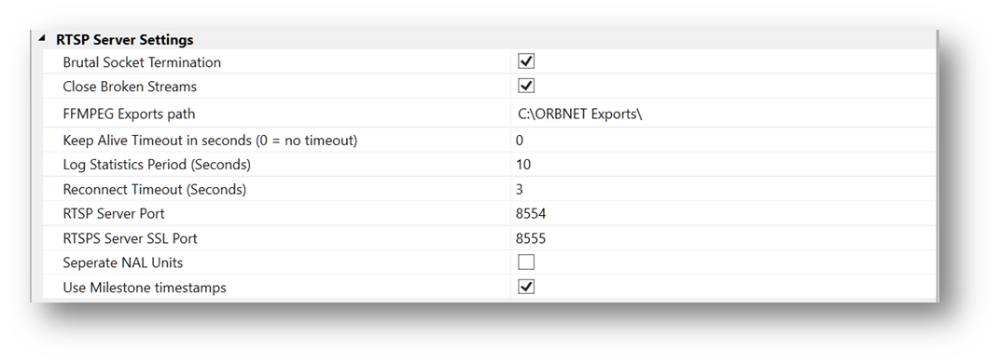

## Streaming Engine Settings

These options allow for additional Streaming Engine service advance
setting changes.

<u>Backup/Paused Video GUID</u> when video connection issues occur, or
the video channel is paused in Milestone this is the GUID ID of the
camera device that will be used. This helps the Streaming Engine process
the video feed correctly and close a relevant open socket port till the
video is re-established.

<u>Log Level</u> three options Normal, Debug and Trace. Normal provides
all general information required for audit purposes. Debug can be used
to help with troubleshooting of a video channel or service connections.
Trace is best for short bursts as it will create a large sized log file
in a short time. This should be used only when requested by ORBNET
support for assistance with advance streaming.

<u>Managed FFMPEG Streams</u> This feature allows you to use your own
command line arguments to create instances of FFMPEG. FFMPEG can be used
to convert video files but also to transcode live streams. Any FFMPEG
command that you test in a command prompt should work the same here. The
Streaming Engine will create the FFMPEG process in the backend and keep
it alive for you. If the FFMPEG process stops or stops converting, the
Streaming Engine will attempt to restart it automatically.

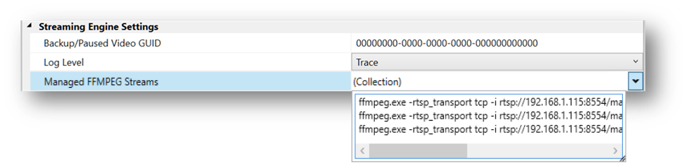

## UDP Settings

As default the Streaming Engine will send streams as TCP, this setting
section allows the Streaming Engine to also utilize UDP.

<u>Enable UDP</u> tick to enable UDP for all streams

<u>UDP sending port override</u> (<u>default -1</u>) use this parameter
to force the Streaming Engines local UDP port for sending video streams.
This parameter is only useful for sending UDP Streams through routers.

<u>UDP Start Port</u> (<u>default 50000</u>) the Streaming Engine will
use a range of UDP ports from \<<u>UDP Start Port</u>\> to 65535 to send
out video streams. RTSP over UDP utilizes a pair of ports per
connection.

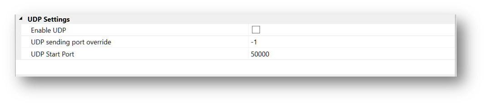

# Streaming Engine API Data

## CSV Export – Cameras Information

Go <u>http://\<streaming-engine-IP\>:45333/API/CSV/cameras/</u>

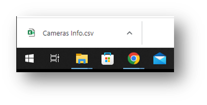A
CSV file will be downloaded immediately, following the below format.

**Name,GUID,Enabled,Streaming Engine RTSP,Motion,Recording,GPS**

Camera 1,63c02a95-4d86-4d63-95ac-b3b755784c7d,True,False,True,True,POINT
(2.5352541368317 48.603436591765917699 0)

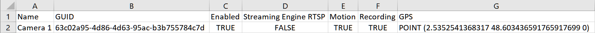

<u>Name</u> camera name taken from Milestone.

<u>GUID</u> unique camera reference ID taken from Milestone.

<u>Enabled</u> (TRUE / FALSE) shows TRUE when video stream is enabled in
Milestone.

<u>Streaming Engine RTSP</u> (TRUE / FALSE) shows <u>TRUE</u> when RTSP
streaming is ticked in Streaming Engine tab for video channel.

<u>Motion</u> (TRUE / FALSE) shows <u>TRUE</u> when motion recording is
enabled in Milestone.

<u>Recording</u> (TRUE / FALSE) shows TRUE when recording is enabled in
Milestone.

<u>GPS</u> (POINT EMPTY / POINT (GPS Position) this is taken from the
video channel settings in Milestone.

# Import HTTPS Certificate

Find the Streaming Engine Manager in the taskbar. If the task icon is
not showing, check that it is not hidden in the system tray or run from
the desktop shortcut to open.

Right click the tray icon and select Change
settings…

The <u>Streaming Engine Certificate Importer</u> window will follow.
This allows you Generate Self-signed certificate, Import a Certificate
authority signed certificate via Browse and specify the Certificate
Password via the input field. When complete run Import PFX to complete
the HTTPS setup.

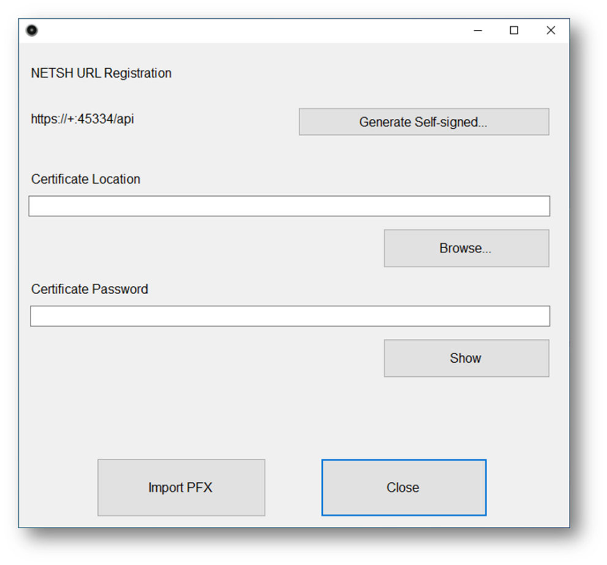

# System TCP/IP Ports Used

Below lists the default ports used by the Streaming Engine and Milestone
to use the relevant services.

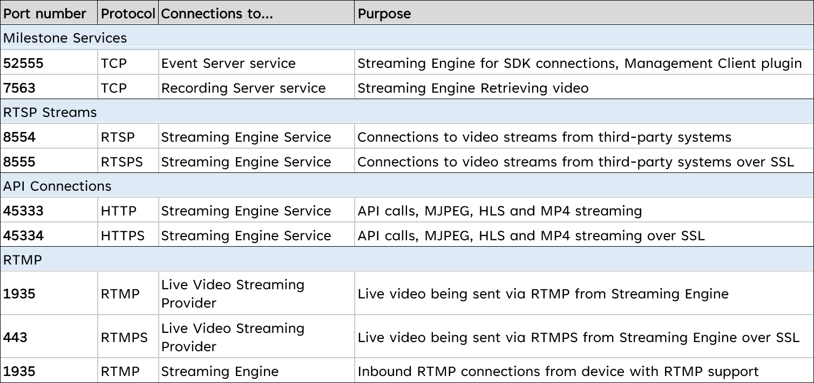

# Troubleshooting

### Event Server Installation

If Milestone was installed via a custom installation, the Event service
may not have been included as it is not always required.

From the server/machine with the Milestone Management service follow to
[http://localhost/installation/admin/](http://localhost/installation/admin)
(Some installations will require a port following the server’s name or
IP address)

This will provide a Milestone installation page where you will be about
to run the installer for the Event Server. This must be installed so the
ORBNET plugin can communicate with Milestone.

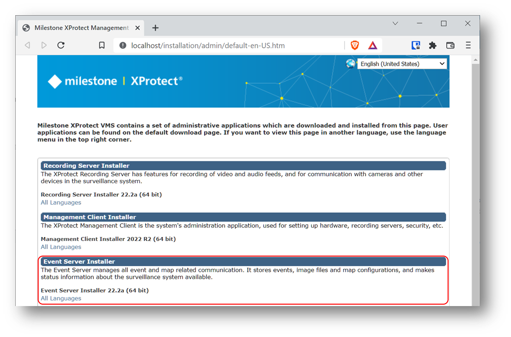
